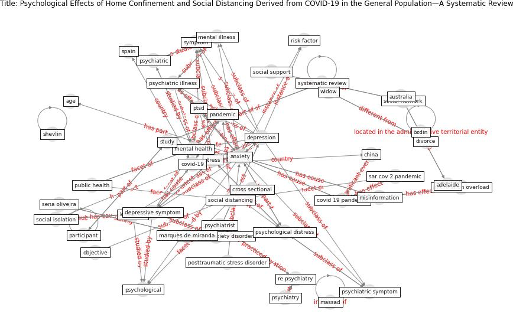

# Article: Psychological Effects of Home Confinement and Social Distancing Derived from COVID-19 in the General Population—A Systematic Review (rodriguez-fernandez_psychological_2021)

* Source: [10.3390/ijerph18126528](https://doi.org/10.3390/ijerph18126528)
* Year: 2021
* Cluster: [city-health](cluster_14)

## Keywords

 * 8 8 dean et, 8 8 ngoc cong duong et, adelaide, age, alkhamee, [anxiety](keyword_anxiety), anxiety disorder, anxiety symptom, [australia](keyword_australia), brain behav, [canada](keyword_canada), [china](keyword_china), coronavirus pandemic, [country](keyword_country), covid 19 outbreak, [covid 19 pandemic](keyword_covid_19_pandemic), [covid-19](keyword_covid-19), cross sectional, database, [depression](keyword_depression), [depressive symptom](keyword_depressive_symptom), divorce, east, [education](keyword_education), female, front, galea, gender, generalize anxiety, generalize anxiety disorder, immun, immunologist, [information](keyword_information), information overload, [internet](keyword_internet), jbi, joanna briggs institute, [loneliness](keyword_loneliness), longitudinal, longitudinal study, lurie, mahan, main objective, marques de miranda, massad, [mental health](keyword_mental_health), mental illness, [misinformation](keyword_misinformation), nandi, neria, neuroscience, objective, [outbreak](keyword_outbreak), [pandemic](keyword_pandemic), participant, posttraumatic stress disorder, psychiatric, psychiatric illness, psychiatric symptom, [psychiatrist](keyword_psychiatrist), psychiatry, psychol, [psychological](keyword_psychological), psychological distress, psychology, ptsd, [public health](keyword_public_health), puebla, quarantine, re psychiatry, [research](keyword_research), [risk](keyword_risk), risk factor, [sar cov 2](keyword_sar_cov_2), sar cov 2 pandemic, [saudi arabia](keyword_saudi_arabia), scientific, sena oliveira, shevlin, single, [social distancing](keyword_social_distancing), social health crisis, social isolation, social network, social support, [south korea](keyword_south_korea), [spain](keyword_spain), statistical analysis, [stress](keyword_stress), [study](keyword_study), [switzerland](keyword_switzerland), [symptom](keyword_symptom), systematic review, [toronto](keyword_toronto), unemployed, urol, web of science, west, widow, özdin

## Concepts

 

## Neighbours

### Closest articles

* The psychological impact of COVID-19 on the mental health in the general population - [LINK](article_serafini_psychological_2020)
* Mental Health and the Covid-19 Pandemic - [LINK](article_pfefferbaum_mental_2020)
* Home garden use during COVID-19: Associations with physical and mental wellbeing in older adults - [LINK](article_corley_home_2021)
* Mental health and COVID-19 - [LINK](article_who_mental_2021)
* COVID-19 Lockdown: Housing Built Environment’s Effects on Mental Health - [LINK](article_amerio_covid-19_2020)
* Mental health economics: A prospective study on psychological flourishing and associations with healthcare costs and sickness benefit transfers in Denmark - [LINK](article_santini_mental_2021)
* Treating two pandemics for the price of one: Chronic and infectious disease impacts of the built and natural environment - [LINK](article_frank_treating_2021)
* The socio-economic determinants of COVID-19: A spatial analysis of German county level data - [LINK](article_ehlert_socio-economic_2021)
* Association of built environment attributes with the spread of COVID-19 at its initial stage in China - [LINK](article_li_association_2021)
* Urban design attributes and resilience: COVID-19 evidence from New York City - [LINK](article_yang_urban_2021)

### Closest BPs

* Blueprint: Resilience in staffing and skills training - [LINK](bp_12)
* Blueprint: Smart Locker System - [LINK](bp_1)
* Blueprint: Public places as information points - [LINK](bp_8)
