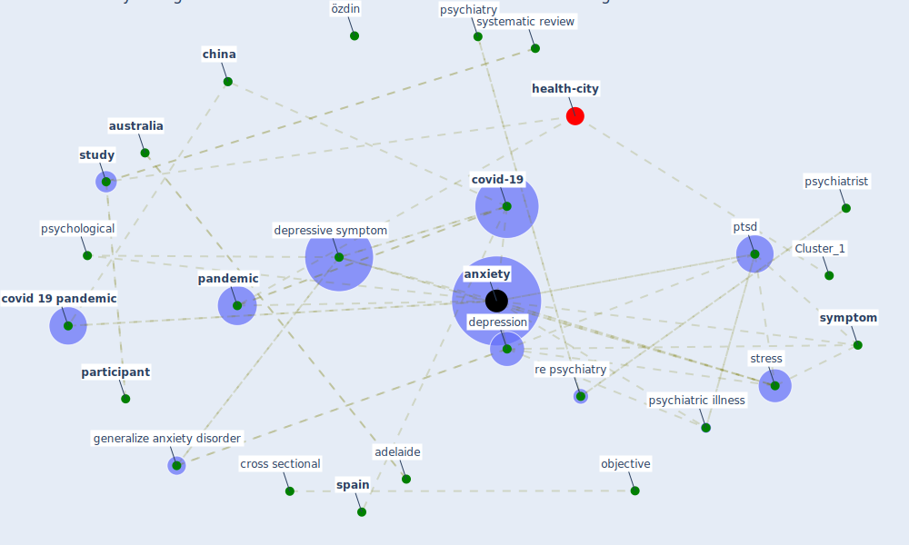

# Article: Psychological Effects of Home Confinement and Social Distancing Derived from COVID-19 in the General Population—A Systematic Review (rodriguez-fernandez_psychological_2021)

* Source: [10.3390/ijerph18126528](https://doi.org/10.3390/ijerph18126528)
* Year: 2021
* Cluster: [health-city](cluster_1)

## Keywords

 * 8 8 dean et, 8 8 ngoc cong duong et, adelaide, affect, age, alkhamee, almohimee, [anxiety](keyword_anxiety), anxiety disorder, anxiety symptom, aromataris, [australia](keyword_australia), basel, behaviour, brain behav, braz, [canada](keyword_canada), [china](keyword_china), coronavirus pandemic, [country](keyword_country), covid 19 outbreak, [covid 19 pandemic](keyword_covid_19_pandemic), [covid-19](keyword_covid-19), cross sectional, database, [depression](keyword_depression), [depressive symptom](keyword_depressive_symptom), divorce, east, [education](keyword_education), female, florida, flowchart, front, galea, gender, generalize anxiety, generalize anxiety disorder, immun, immunologist, [information](keyword_information), [information overload](keyword_information_overload), jbi, longitudinal, lurie, mahan, main objective, male, marques de miranda, married people, marry, massad, mediterr, mild anxiety, [misinformation](keyword_misinformation), nandi, neria, neuroscience, objective, [outbreak](keyword_outbreak), outcome, [pandemic](keyword_pandemic), [participant](keyword_participant), posttraumatic stress disorder, psychiatric illness, [psychiatrist](keyword_psychiatrist), psychiatry, [psychological](keyword_psychological), ptsd, puebla, [quarantine](keyword_quarantine), [re psychiatry](keyword_re_psychiatry), [research](keyword_research), [risk](keyword_risk), risk factor, [russia](keyword_russia), [sar cov 2](keyword_sar_cov_2), sar cov 2 pandemic, [saudi arabia](keyword_saudi_arabia), second wave, sena oliveira, sex, shevlin, shevlin et, single, [south korea](keyword_south_korea), [spain](keyword_spain), [stress](keyword_stress), [study](keyword_study), [switzerland](keyword_switzerland), [symptom](keyword_symptom), systematic review, [toronto](keyword_toronto), unemployed, urol, web of science, west, widow, [wuhan](keyword_wuhan), özdin

## Concepts

 

## Neighbours

### Closest articles

* The psychological impact of COVID-19 on the mental health in the general population - [LINK](article_serafini_psychological_2020)
* Mental Health and the Covid-19 Pandemic - [LINK](article_pfefferbaum_mental_2020)
* Mental health and COVID-19 - [LINK](article_who_mental_2021)
* COVID-19 Lockdown: Housing Built Environment’s Effects on Mental Health - [LINK](article_amerio_covid-19_2020)
* Home garden use during COVID-19: Associations with physical and mental wellbeing in older adults - [LINK](article_corley_home_2021)
* Amplifying the role of knowledge translation platforms in the COVID-19 pandemic response - [LINK](article_el-jardali_amplifying_2020)
* Should I Stay or Should I Go? Tourists’ COVID-19 Risk Perception and Vacation Behavior Shift - [LINK](article_bratic_should_2021)
* Seeing the invisible hand: Underlying effects of COVID-19 on tourists’ behavioral patterns - [LINK](article_li_seeing_2020)
* From Viral City to Smart City: Learning from Pandemic Experiences - [LINK](article_sakellarides_viral_2020)
* Mental health economics: A prospective study on psychological flourishing and associations with healthcare costs and sickness benefit transfers in Denmark - [LINK](article_santini_mental_2021)

### Closest BPs

* Blueprint: Resilience in staffing and skills training - [LINK](bp_12)
* Blueprint: Installing high-efficiency air filters - [LINK](bp_11)
* Blueprint: Air Cleaning Plants - [LINK](bp_15)
