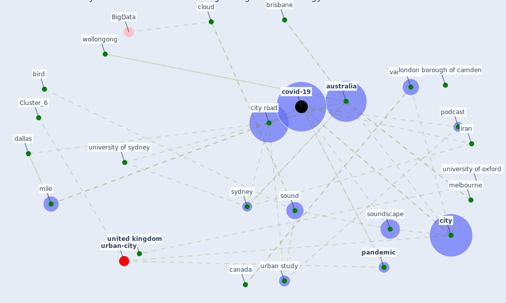

# Article: The City Under COVID‐19: Podcasting As Digital Methodology (rogers_city_2020)

* Source: [10.1111/tesg.12426](https://doi.org/10.1111/tesg.12426)
* Year: 2020
* Cluster: [health-city](cluster_1)

## Keywords

 * I be unable to concentrate, academic, academic podcasting, academic praxis, agloba, [air](keyword_air), analytical, applepodcast, audio, audio editing suite, [australia](keyword_australia), bird, brisbane, [canada](keyword_canada), [china](keyword_china), christchurch, [city](keyword_city), city road, city road listener, city under covid 19, class, [cloud](keyword_cloud), [comms](keyword_comms), communication, [covid 19 pandemic](keyword_covid_19_pandemic), [covid-19](keyword_covid-19), cuba, curatorial, dallas, dallas and mile, dialogue, [economic](keyword_economic), email, [experience](keyword_experience), fox, george orwell, guardian, henry wadsworth longfellow, [india](keyword_india), inequality, invisibility, iran, j l, john cage, kraków, la habana, listen, [london](keyword_london), london borough of camden, los angeles, maginn, [melbourne](keyword_melbourne), methodology, microphone, mile, nancy, narrative, [new york](keyword_new_york), [new york city](keyword_new_york_city), new zealand, nineteen eighty four, north, pablo picasso, [pandemic](keyword_pandemic), [people](keyword_people), perth, [podcast](keyword_podcast), privilege, [qualitative](keyword_qualitative), qualitative research, [research](keyword_research), research method, [researcher](keyword_researcher), san francisco bay area, school of architecture design and planning, school of design, [social](keyword_social), sonic geography, [sound](keyword_sound), soundcloud, soundscape, south, strange, [sydney](keyword_sydney), tasmania, tchaikovsky, [traffic](keyword_traffic), [united kingdom](keyword_united_kingdom), university of melbourne, university of oxford, university of sydney, university of western australia, [urban](keyword_urban), urban study, vancouver, verso london, visibility, whitzman, wollongong, [wuhan](keyword_wuhan)

## Concepts

 

## Neighbours

### Closest articles

* 10 Adaptive Measures for Public Places to face the COVID 19 Pandemic Outbreak - [LINK](article_cheshmehzangi_10_2020)
* Urban design attributes and resilience: COVID-19 evidence from New York City - [LINK](article_yang_urban_2021)
* Dangerous liaisons? Applying the social harm perspective to the social inequality, housing and health trifecta during the Covid-19 pandemic - [LINK](article_gurney_dangerous_2021)
* Eviction, Health Inequity, and the Spread of COVID-19: Housing Policy as a Primary Pandemic Mitigation Strategy - [LINK](article_benfer_eviction_2021)
* Green spaces, especially forest, linked to lower SARS-CoV-2 infection rates: A one-year nationwide study - [LINK](article_jiang_green_2021)
* Association of built environment attributes with the spread of COVID-19 at its initial stage in China - [LINK](article_li_association_2021)
* Public housing and COVID-19: contestation, challenge and change - [LINK](article_power_public_2020)
* Amplifying the role of knowledge translation platforms in the COVID-19 pandemic response - [LINK](article_el-jardali_amplifying_2020)
* Association between indoor-outdoor green features and psychological health during the COVID-19 lockdown in Italy: A cross-sectional nationwide study - [LINK](article_spano_association_2021)
* From Viral City to Smart City: Learning from Pandemic Experiences - [LINK](article_sakellarides_viral_2020)

### Closest BPs

* Blueprint: Resilience in staffing and skills training - [LINK](bp_12)
* Blueprint: Monitoring of wastewater - [LINK](bp_21)
* Blueprint: Installing high-efficiency air filters - [LINK](bp_11)
