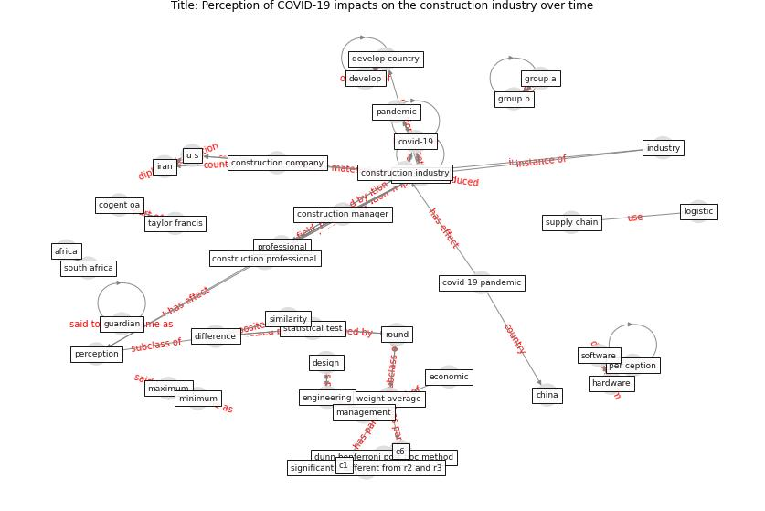

# Article: __Perception of COVID-19 impacts on the construction industry over time__ (rokooei_perception_2022)

* [10.1080/23311916.2022.2044575](https://doi.org/10.1080/23311916.2022.2044575)
* Cluster: [construction-project](cluster_6)

## Keywords

* [construction](keyword_construction), [covid-19](keyword_covid-19), [construction industry](keyword_construction_industry), [construction professional](keyword_construction_professional), [professional](keyword_professional), [pandemic](keyword_pandemic), [u s](keyword_u_s), [software](keyword_software), [round](keyword_round), [group b](keyword_group_b), hardware, iran, [perception](keyword_perception), group a, [industry](keyword_industry)

## Keywords at large

* [construction](keyword_construction), [covid-19](keyword_covid-19), [construction industry](keyword_construction_industry), [construction professional](keyword_construction_professional), [professional](keyword_professional), [pandemic](keyword_pandemic), [group b](keyword_group_b), [u s](keyword_u_s), [software](keyword_software), [round](keyword_round)

## Concepts

 

### Closest articles 

* [The Impact of Pandemic Crisis on the Survival of Construction Industry: A Case of COVID-19](article_gamil_impact_2020)
* [Effects to Construction Project Management Impacted Circular Economic of Covid-19 Pandemic](article_paikan_effects_2021)
* [COVID-19 pandemic: the effects and prospects in the
construction industry.](article_ogunnusi_covid-19_2020)
* [Mechanisms for addressing the impact of COVID-19 on infrastructure projects](article_king_mechanisms_2021)
* [The Effects of Pandemic on Construction Industry in the UK](article_shibani_effects_2020)
* [Overcoming the Impact of COVID-19 Using Integrated Project Delivery Model](article_g_overcoming_2020)
* [Guidelines for Responding to COVID-19 Pandemic: Best Practices, Impacts, and Future Research Directions](article_assaad_guidelines_2021)
* [Influence between COVID-19 Impacts and Project Stakeholders in Chilean Construction Projects](article_araya_influence_2021)
* [Propositions for a Resilient, Post-COVID-19 Future
for the AEC Industry](article_nassereddine_propositions_2021)
* [Analysis of COVID-19 Concerns Raised by the Construction Workforce and Development of Mitigation Practices](article_bou_hatoum_analysis_2021)

### References 

* [Influence between COVID-19 Impacts and Project
Stakeholders in Chilean Construction Projects](article_araya_influence_2021)
* [Guidelines for Responding to COVID-19 Pandemic:
Best Practices, Impacts, and Future Research
Directions](article_assaad_guidelines_2021)
* [The Impact of Pandemic Crisis on the Survival of
Construction Industry: A Case of COVID-19](article_gamil_impact_2020)

### Cited by 

