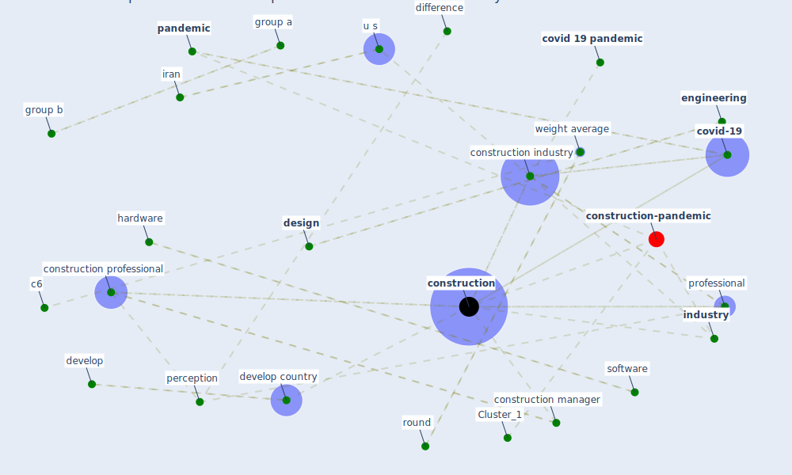

# Article: Perception of COVID-19 impacts on the construction industry over time (rokooei_perception_2022)

* Source: [10.1080/23311916.2022.2044575](https://doi.org/10.1080/23311916.2022.2044575)
* Year: 2022
* Cluster: [construction-project](cluster_8)

## Keywords

 * 5 level likert scale, 5 sirþ1 i¼1 nrþ1 ð r¼1, a1, [africa](keyword_africa), america, ascend trend, [australia](keyword_australia), c1, c3, c6, [china](keyword_china), cogent oa, construc tion, [construction](keyword_construction), construction economic, [construction industry](keyword_construction_industry), construction management, construction manager, [construction professional](keyword_construction_professional), [coronavirus](keyword_coronavirus), correlation analysis, [cost](keyword_cost), [country](keyword_country), [covid 19 pandemic](keyword_covid_19_pandemic), [covid-19](keyword_covid-19), credit, cross sectional, [datum](keyword_datum), delay, descend trend, [design](keyword_design), develop, develop country, difference, [disease](keyword_disease), divergence, dunn bonferroni post hoc method, [economic](keyword_economic), economic status, [economy](keyword_economy), [engineering](keyword_engineering), [epidemic](keyword_epidemic), equation 1, ghana, group a, group b, guardian, hardware, independent variable, [industry](keyword_industry), iran, [italy](keyword_italy), jallow, kukah, license, licensor, likert scale, limitation, [lockdown](keyword_lockdown), [logistic](keyword_logistic), [management](keyword_management), [maximum](keyword_maximum), minimum, [pandemic](keyword_pandemic), per ception, perception, post hoc test, preparedness, previous section, [professional](keyword_professional), [project](keyword_project), [project management](keyword_project_management), quantitative datum, [rate](keyword_rate), regional, renukappa, [research](keyword_research), round, significantly different from r2 and r3, similarity, simpeh, [social](keyword_social), [society](keyword_society), software, south, [south africa](keyword_south_africa), [supply chain](keyword_supply_chain), supply shock, [system](keyword_system), taylor francis, [test](keyword_test), [transportation](keyword_transportation), trento, [u k](keyword_u_k), u s, [united kingdom](keyword_united_kingdom), virus pandemic, weight average, weight average score, work time

## Concepts

 

## Neighbours

### Closest articles

* The Impact of Pandemic Crisis on the Survival of Construction Industry: A Case of COVID-19 - [LINK](article_gamil_impact_2020)
* Mechanisms for addressing the impact of COVID-19 on infrastructure projects - [LINK](article_king_mechanisms_2021)
* Effects to Construction Project Management Impacted Circular Economic of Covid-19 Pandemic - [LINK](article_paikan_effects_2021)
* Influence between COVID-19 Impacts and Project Stakeholders in Chilean Construction Projects - [LINK](article_araya_influence_2021)
* COVID-19 pandemic: the effects and prospects in the construction industry. - [LINK](article_ogunnusi_covid-19_2020)
* Overcoming the Impact of COVID-19 Using Integrated Project Delivery Model - [LINK](article_g_overcoming_2020)
* The Effects of Pandemic on Construction Industry in the UK - [LINK](article_shibani_effects_2020)
* Identifying Actions to Control and Mitigate the Effects of the COVID-19 Pandemic on Construction Organizations: Preliminary Findings - [LINK](article_raoufi_identifying_2021)
* Covid-19 Associated Risks and Mitigation Strategies relevant for the UK Construction Industry - [LINK](article_dan-jumbo_covid-19_2021)
* Propositions for a Resilient, Post-COVID-19 Future for the AEC Industry - [LINK](article_nassereddine_propositions_2021)

### Closest BPs

* Blueprint: Installing UV in ductwork - [LINK](bp_10)
* Blueprint: Resilience in staffing and skills training - [LINK](bp_12)
* Blueprint: Monitoring of wastewater - [LINK](bp_21)
