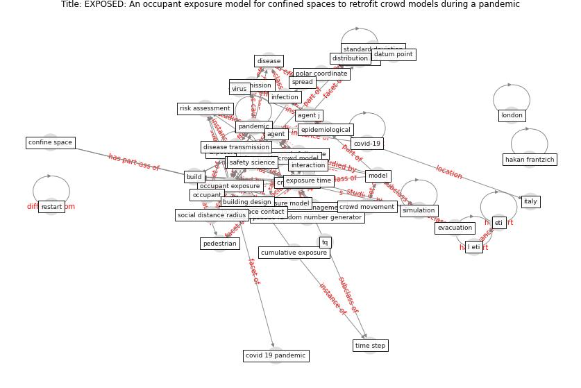

# Article: __EXPOSED: An occupant exposure model for confined spaces to retrofit crowd models during a pandemic__ (ronchi_exposed_2020)

* [10.1016/j.ssci.2020.104834](https://doi.org/10.1016/j.ssci.2020.104834)
* Cluster: [space-urban](cluster_13)

## Keywords

* [crowd model](keyword_crowd_model), [pandemic](keyword_pandemic), [occupant exposure](keyword_occupant_exposure), [model](keyword_model), [exposure](keyword_exposure), [risk assessment](keyword_risk_assessment), [expose](keyword_expose), [disease transmission](keyword_disease_transmission), [simulation](keyword_simulation), [agent](keyword_agent), [build](keyword_build), microscopic crowd model, exposure time, [disease](keyword_disease), crowd management

## Keywords at large

* [biophilic design](keyword_biophilic_design), [architecture](keyword_architecture), [sustainable architecture](keyword_sustainable_architecture), [nature](keyword_nature), [design](keyword_design), [biophilic](keyword_biophilic), [environ](keyword_environ), [biophilia](keyword_biophilia), [wellbeing](keyword_wellbeing), [health](keyword_health)

## Concepts

 

