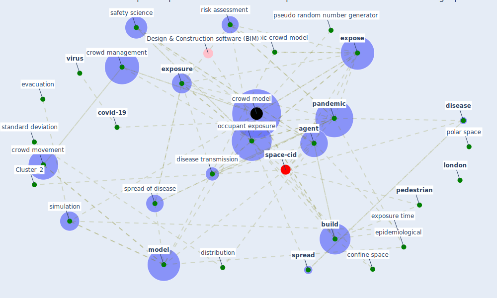

# Article: EXPOSED: An occupant exposure model for confined spaces to retrofit crowd models during a pandemic (ronchi_exposed_2020)

* Source: [10.1016/j.ssci.2020.104834](https://doi.org/10.1016/j.ssci.2020.104834)
* Year: 2020
* Cluster: [air-sars](cluster_9)

## Keywords

 * I eti, [agent](keyword_agent), agent I, agent j, [australia](keyword_australia), bellomo, [big datum](keyword_big_datum), boxplot, [build](keyword_build), [building](keyword_building), building design, c0, [circle](keyword_circle), ck, [computer](keyword_computer), confine space, contagion, contain, [control](keyword_control), [corridor](keyword_corridor), covid 19 epidemic, [covid 19 pandemic](keyword_covid_19_pandemic), [covid-19](keyword_covid-19), crowd management, [crowd model](keyword_crowd_model), crowd movement, cumulative exposure, cumulative exposure ck, datum point, decision maker, direction of movement, [disease](keyword_disease), disease transmission, disease transmission mechanism, distribution, door, eitq eitf en entq entf, ellipse, enrico ronchi, [epidemiological](keyword_epidemiological), eti, evacuation, exploitation, expose, [exposure](keyword_exposure), exposure time, face, face to face contact, fire saf, fire safety engineering, fluid, framework, håkan frantzich, [infection](keyword_infection), [interaction](keyword_interaction), [italy](keyword_italy), [korea](keyword_korea), [london](keyword_london), magnitude, math, mathematical, matrix, maximum, michele fronterrè, microscopic crowd model, [mobility](keyword_mobility), [model](keyword_model), [new south wale](keyword_new_south_wale), new zealand, nose, [occupant](keyword_occupant), [occupant exposure](keyword_occupant_exposure), occupant exposure g, occupant exposure model, [pandemic](keyword_pandemic), [pedestrian](keyword_pedestrian), people movement, polar coordinate, polar space, pseudo random number generator, radius of interaction, restart, risk assessment, ronchi, [room](keyword_room), safety science, scenario, [simulation](keyword_simulation), [spread](keyword_spread), spread of disease, [standard](keyword_standard), standard deviation, summation, time step, tki, tq, [transmission](keyword_transmission), verification, [virus](keyword_virus), visualize

## Concepts

 

## Neighbours

### Closest articles

* COVID-ABS: An agent-based model of COVID-19 epidemic to simulate health and economic effects of social distancing interventions - [LINK](article_silva_covid-abs_2020)
* Building occupancy estimation with people flow modeling in AnyLogic - [LINK](article_li_building_2016)
* Digital Twin of COVID-19 Mass Vaccination Centers - [LINK](article_pilati_digital_2021)
* COVID19-Routes: A Safe Pedestrian Navigation Service - [LINK](article_cantarero_covid19-routes_2021)
* Exploring the Non-Medical impacts of Covid-19 using Natural Language Processing - [LINK](article_agade_exploring_2020)
* Construction of a Linked Data Set of COVID-19 Knowledge Graphs: Development and Applications - [LINK](article_wang_construction_2022)
* Management of the COVID-19 pandemic: challenges, practices, and organizational support - [LINK](article_hossny_management_2022)
* Risk Diagnosis and Mitigation System of COVID-19 Using Expert System and Web Scraping - [LINK](article_mufid_risk_2020)
* Using Technology to Maintain the Education of Residents During the COVID-19 Pandemic - [LINK](article_chick_using_2020)
* COVID-19: A new digital dawn? - [LINK](article_robbins_covid-19_2020)

### Closest BPs

* Blueprint: Resilience in staffing and skills training - [LINK](bp_12)
* Blueprint: Tracking and enforcing use of Personal Protective Equipment - [LINK](bp_23)
* Blueprint: Air Cleaning Plants - [LINK](bp_15)
