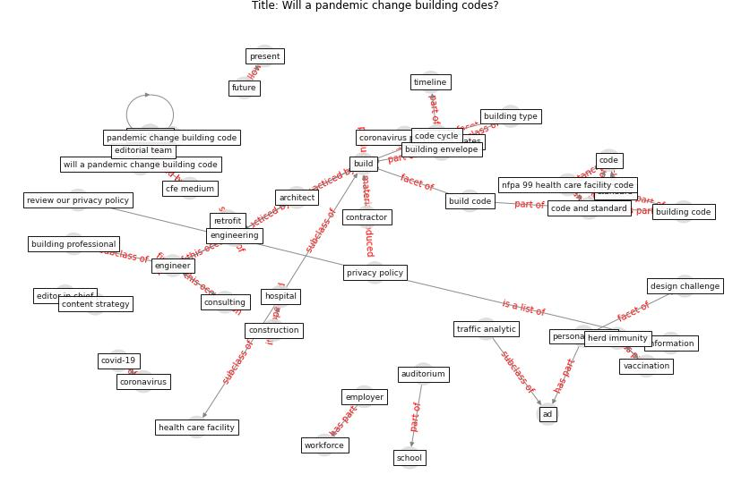

# Article: Will a pandemic change building codes? (rozgus_will_2020)

* [https://www.csemag.com/articles/will-a-pandemic-change-building-codes/](https://www.csemag.com/articles/will-a-pandemic-change-building-codes/)
* Year: 2020
* Cluster: [building-space](cluster_1)

## Keywords

 * [ad](keyword_ad), amaar rozgus, [architect](keyword_architect), auditorium, author bio, [build](keyword_build), build expert, build professional, building code, building code and standard trend, building envelope, building type, building type code and standard, cfe, cfe medium, code, code and standard, code cycle, [construction](keyword_construction), consulting, content, content strategy, [contractor](keyword_contractor), [coronavirus](keyword_coronavirus), coronavirus pandemic, [covid-19](keyword_covid-19), [design](keyword_design), design challenge, editor in chief, editorial team, [employee](keyword_employee), [employer](keyword_employer), engineer, engineer ad, [engineering](keyword_engineering), future, health care facility, herd immunity, [hospital](keyword_hospital), [information](keyword_information), magazine, medium, new technology, newsletter, next code cycle, nfpa, nfpa 99 health care facility code, [pandemic](keyword_pandemic), pandemic change building code, [personalization](keyword_personalization), present, [privacy policy](keyword_privacy_policy), [product](keyword_product), [research](keyword_research), retrofit, [review our privacy policy](keyword_review_our_privacy_policy), [school](keyword_school), search, search product, [standard](keyword_standard), technical topic, [technology](keyword_technology), three year timeline, timeline, traffic analytic, [unesco](keyword_unesco), [united states](keyword_united_states), vaccination, will a pandemic change building code, workforce, [world heritage site](keyword_world_heritage_site)

## Concepts

 

## Neighbours

### Closest articles

* How will COVID-19 change future building regulations? - [LINK](article_hmc_architects_how_2020)
* COVID-19 Lessons for a Resilient Built Environment: A Roadmap - [LINK](article_hull_covid-19_2020)
* A study on office workplace modification during the COVID-19 pandemic in The Netherlands - [LINK](article_hou_study_2021)
* COVID-19 Experience Transforming the Protective Environment of Office Buildings and Spaces - [LINK](article_phapant_covid-19_2021)
* Navigating Climate Change: Rethinking the Role of Buildings - [LINK](article_cole_navigating_2020)
* The COVID-19 Impact on Flexible Office Space - [LINK](article_clifton_covid-19_2020)
* It’s time to reimagine where and how work will get done (PwC’s US Remote Work Survey) - [LINK](article_pricewaterhousecoopers_its_2021)
* Adaptive Design of the Built Environment to Mitigate the Transmission Risk of COVID-19 - [LINK](article_ara_dilshad_shangi_adaptive_2020)
* How Architecture Fails in Conditions of Crisis: a Discussion on the Value of Interior Design over the COVID-19 Outbreak - [LINK](article_rassia_how_2020)
* Biophilic design in architecture and its contributions to health, well-being, and sustainability: A critical review - [LINK](article_zhong_biophilic_2022)

### Closest BPs

* Blueprint: Architecture design - [LINK](bp_2)
* Blueprint: Building Adaptation during a pandemic - [LINK](bp_14)
* Blueprint: Tender support at building stage - [LINK](bp_9)
