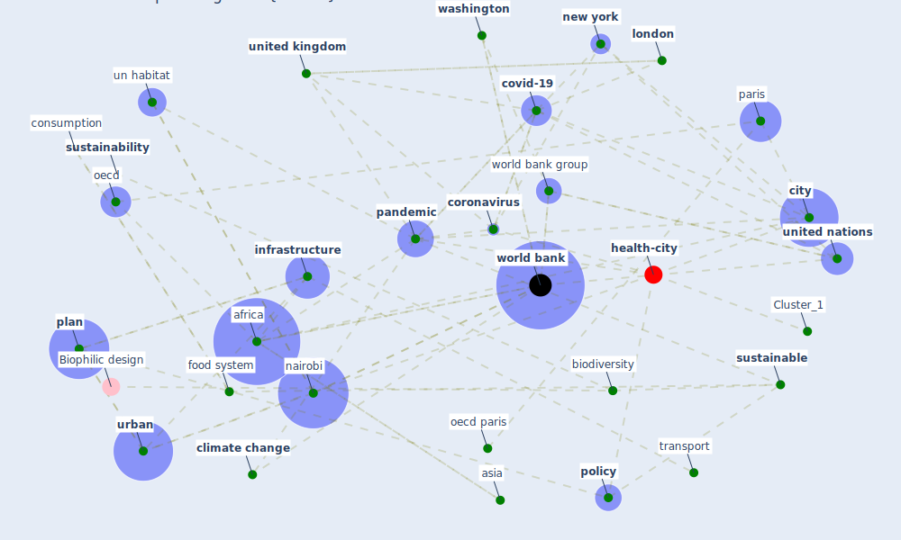

# Article: Urban planning after COVID-19 (rtpi_urban_2021)

* [https://www.rtpi.org.uk/research/2021/october/urban-planning-after-covid-19/](https://www.rtpi.org.uk/research/2021/october/urban-planning-after-covid-19/)
* Year: 2021
* Cluster: [urban-city](cluster_6)

## Keywords

 * abidjan, [africa](keyword_africa), algeria, apply research, asia, bbc, [biodiversity](keyword_biodiversity), blog, caribbean, [china](keyword_china), [city](keyword_city), [climate](keyword_climate), [climate change](keyword_climate_change), [community](keyword_community), consumption, [coronavirus](keyword_coronavirus), [country](keyword_country), [covid 19 pandemic](keyword_covid_19_pandemic), [covid-19](keyword_covid-19), [cycling](keyword_cycling), [economic](keyword_economic), economic growth, [economy](keyword_economy), [ecosystem](keyword_ecosystem), [energy](keyword_energy), [europe](keyword_europe), fao, food and agriculture organization, food system, geneva, [germany](keyword_germany), global, [health](keyword_health), high volume transport, [housing](keyword_housing), ibid, imc, [india](keyword_india), indigenous people, [indonesia](keyword_indonesia), inequality, [infrastructure](keyword_infrastructure), [kenya](keyword_kenya), lago, latin america, [lockdown](keyword_lockdown), [logistic](keyword_logistic), [london](keyword_london), [low](keyword_low), [malaysia](keyword_malaysia), mangrove, metropolis, middle income country, [nairobi](keyword_nairobi), [new york](keyword_new_york), [nigeria](keyword_nigeria), [oecd](keyword_oecd), oecd paris, [organisation](keyword_organisation), organisation for economic co operation and development, [pandemic](keyword_pandemic), paris, [pedestrian](keyword_pedestrian), [plan](keyword_plan), [policy](keyword_policy), pollution, poverty, production, [public](keyword_public), [public space](keyword_public_space), [public transport](keyword_public_transport), [resilience](keyword_resilience), slum, [social](keyword_social), [south africa](keyword_south_africa), sub saharan, [sustainability](keyword_sustainability), sustainable, [sustainable development goal](keyword_sustainable_development_goal), sustainable transport, sustainable urbanisation, [tourism](keyword_tourism), [transport](keyword_transport), un habitat, unctad, undesa, [united kingdom](keyword_united_kingdom), [united nations](keyword_united_nations), [urban](keyword_urban), urban area, urban development, urbanization, value chain, [vulnerability](keyword_vulnerability), walk, [washington](keyword_washington), [wellbee](keyword_wellbee), [world bank](keyword_world_bank), world bank group, zambia

## Concepts

 

## Neighbours

### Closest articles

* Proximity and post-COVID-19 urban development: Reflections from Milan, Italy - [LINK](article_tricarico_proximity_2021)
* A critical analysis of the impacts of COVID-19 on the global economy and ecosystems and opportunities for circular economy strategies - [LINK](article_ibn-mohammed_critical_2021)
* Building up an ecologically sustainable and socially desirable post-COVID-19 future - [LINK](article_duflot_building_2021)
* Health, Economic and Social Development Challenges of the COVID-19 Pandemic: Strategies for Multiple and Interconnected Issues - [LINK](article_panneer_health_2022)
* COVID-19: Lessons for an Urban(izing) World - [LINK](article_acuto_covid-19_2020)
* COVID-19: IMPACT OF THE PANDEMIC ON THE SUSTAINABLE DEVELOPMENT GOALS - [LINK](article_samout_covid-19_2020)
* COVID-19 and the UN Sustainable Development Goals: Threat to Solidarity or an Opportunity? - [LINK](article_leal_filho_covid-19_2020)
* Revisiting the built environment: 10 potential development changes and paradigm shifts due to COVID-19 - [LINK](article_cheshmehzangi_revisiting_2021)
* How COVID-19 Redefines the Concept of Sustainability - [LINK](article_hakovirta_how_2020)

### Closest BPs

* Blueprint: Smart Locker System - [LINK](bp_1)
* Blueprint: Mental health – Act: Do something - [LINK](bp_18)
* Blueprint: Mental health – Belong: Do something with someone - [LINK](bp_19)
