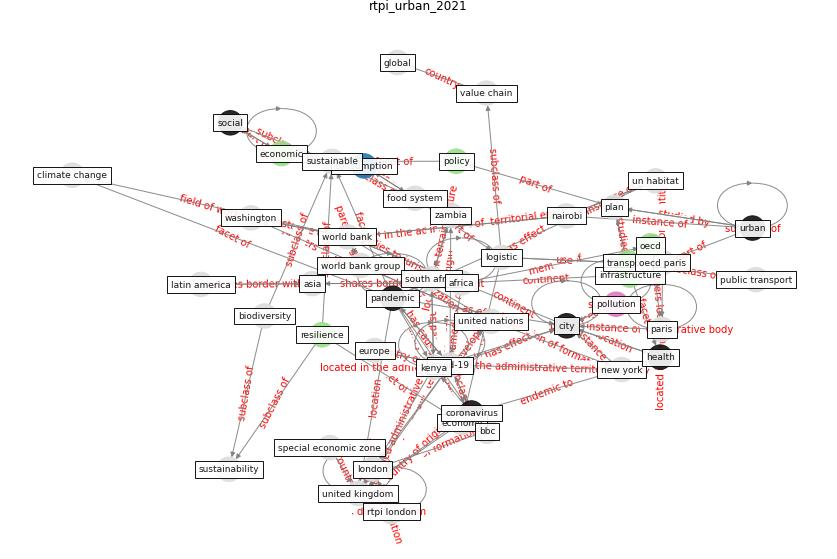

# Article: __Urban planning after COVID-19__ (rtpi_urban_2021)

* URL: [https://www.rtpi.org.uk/research/2021/october/urban-planning-after-covid-19/](https://www.rtpi.org.uk/research/2021/october/urban-planning-after-covid-19/)
* Year: 2021
* Abstract: This paper examines how planning can contribute to the
calls for a sustainable, resilient and inclusive recovery
from the current health and economic crisis.

## Keywords

* [covid-19](keyword_covid-19), [city](keyword_city), [london](keyword_london), [plan](keyword_plan), [nairobi](keyword_nairobi), [paris](keyword_paris), [pandemic](keyword_pandemic), [united kingdom](keyword_united_kingdom), [washington](keyword_washington), [oecd](keyword_oecd), [world bank](keyword_world_bank), [transport](keyword_transport), geneva, [infrastructure](keyword_infrastructure), [united nations](keyword_united_nations)

## Keywords at large

* [biophilic design](keyword_biophilic_design), [architecture](keyword_architecture), [sustainable architecture](keyword_sustainable_architecture), [nature](keyword_nature), [design](keyword_design), [biophilic](keyword_biophilic), [environ](keyword_environ), [biophilia](keyword_biophilia), [wellbeing](keyword_wellbeing), [health](keyword_health)

## Concepts

 

