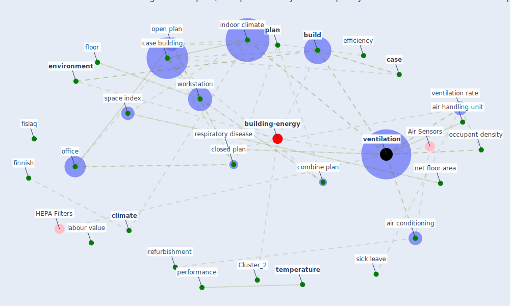

# Article: The effect of a redesigned floor plan, occupant density and the quality of indoor climate on the cost of space, productivity and sick leave in an office building–A case study (saari_effect_2006)

* Source: [10.1016/j.buildenv.2005.07.012](https://doi.org/10.1016/j.buildenv.2005.07.012)
* Year: 2006
* Cluster: [building-energy](cluster_2)

## Keywords

 * [air conditioning](keyword_air_conditioning), air handling unit, [area](keyword_area), [build](keyword_build), build code, [building](keyword_building), building and environment, [case](keyword_case), [case building](keyword_case_building), cell office, [china](keyword_china), [climate](keyword_climate), climate improvement, climate level, climate quality, closed plan, combine plan, cool, cost, cost effective, double corridor, effective use of space, efficiency, efficient, elevation, [energy](keyword_energy), [environment](keyword_environment), [finland](keyword_finland), finnish, finnish standard association, fisiaq, fisk wj, frame module, furnish, [health](keyword_health), heating, helsinki, hierarchy, [hvac](keyword_hvac), ida ice, [indoor](keyword_indoor), [indoor climate](keyword_indoor_climate), indoor climate level, infectious virus, interior design, investment, isiaq, [italy](keyword_italy), [japan](keyword_japan), keegan j, labour value, load bear, [maintenance](keyword_maintenance), meeting room, nardell ea, negative consequence, net floor area, occupant density, office, office building, office floor, open, open plan, open plan office, open plan office, operation, palonen j, partition wall, performance, [plan](keyword_plan), plant room space, [productivity](keyword_productivity), [quality](keyword_quality), refurbishment, [research](keyword_research), respiratory disease, s1, seppa nen, seppa nen o, sf, sfs fi, sick leave, [simulation](keyword_simulation), singapore, smolander j, [space](keyword_space), space index, summer, [temperature](keyword_temperature), torino, [united kingdom](keyword_united_kingdom), university of technology, utility room, [ventilation](keyword_ventilation), ventilation rate, wargocki, [workstation](keyword_workstation), floor, floor area, floor plan

## Concepts

 

## Neighbours

### Closest articles

* Characterization and performance evaluation of a full-scale activated carbon-based dynamic botanical air filtration system for improving indoor air quality - [LINK](article_wang_characterization_2011)
* The Effect of Opening Windows on Air Change Rates in Two Homes - [LINK](article_howard-reed_effect_2002)
* Physical interventions to interrupt or reduce the spread of respiratory viruses: systematic review - [LINK](article_jefferson_physical_2008)
* Contributions to the mitigation of the COVID-19 pandemic - [LINK](article_pilz_contributions_2022)
* COVID-19 Higher Mortality in Chinese Regions With Chronic Exposure to Lower Air Quality - [LINK](article_pansini_covid-19_2021)
* Air pollution linked with higher COVID-19 death rates - [LINK](article_harvard_th_chan_schoold_of_public_health_air_2020)
* COVID-19 Prevention and Control Measures in Workplace Settings: A Rapid Review and Meta-Analysis - [LINK](article_ingram_covid-19_2021)
* COVID-19: Risk assessment and mitigation measures in healthcare and non-healthcare workplaces - [LINK](article_fawzy_covid-19_2021)
* Current knowledge of COVID-19: Advances, challenges and future perspectives - [LINK](article_wu_current_2021)
* Open-source analytics tools for studying the COVID-19 coronavirus outbreak - [LINK](article_wu_open-source_2020)

### Closest BPs

* Blueprint: Monitoring of wastewater - [LINK](bp_21)
* Blueprint: Negative pressure rooms - [LINK](bp_13)
* Blueprint: Installing high-efficiency air filters - [LINK](bp_11)
