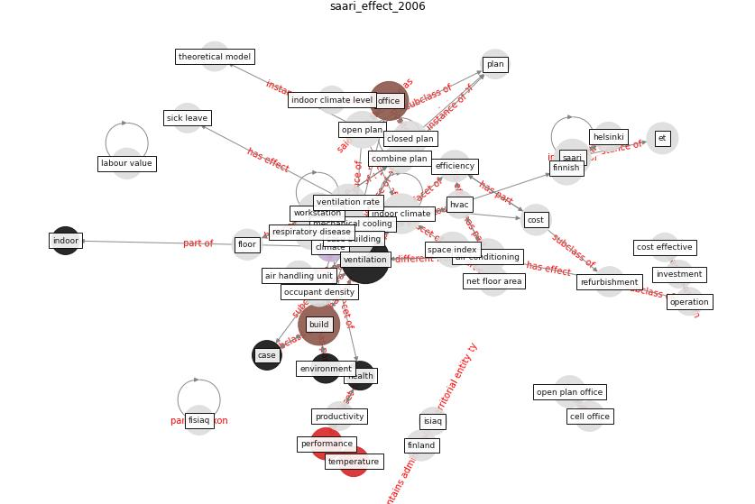

# Article: __The effect of a redesigned floor plan, occupant density and the quality of indoor climate on the cost of space, productivity and sick leave in an office building–A case study__ (saari_effect_2006)

* [10.1016/j.buildenv.2005.07.012](https://doi.org/10.1016/j.buildenv.2005.07.012)
* Cluster: [building-health](cluster_10)

## Keywords

[ventilation](keyword_ventilation), [build](keyword_build), [office](keyword_office)

## Concepts

 

