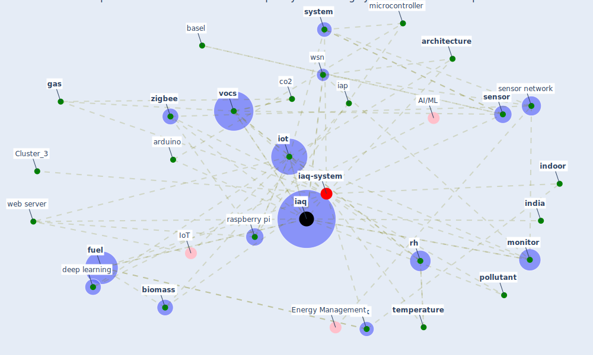

# Article: A comprehensive review on indoor air quality monitoring systems for enhanced public health (saini_comprehensive_2020)

* Source: [10.1186/s42834-020-0047-y](https://doi.org/10.1186/s42834-020-0047-y)
* Year: 2020
* Cluster: [iaq-system](cluster_3)

## Keywords

 * [air pollution](keyword_air_pollution), air quality, air quality monitoring, application layer, [architecture](keyword_architecture), arduino, arduino uno, asthma, atmos, [australia](keyword_australia), basel, benammar, [biomass](keyword_biomass), biomass fuel, c air, chandigarh, [china](keyword_china), [cloud](keyword_cloud), cloud computing, co2, coal, combustion, [cook](keyword_cook), [deep learning](keyword_deep_learning), develop country, electronic nose, email, [energy](keyword_energy), esfahani, esp8266, fatigue, [fuel](keyword_fuel), [gas](keyword_gas), gas sensor, gaseous pollutant, [health](keyword_health), [human health](keyword_human_health), hwang, iap, [iaq](keyword_iaq), iaq monitoring, [iea](keyword_iea), [india](keyword_india), [indoor](keyword_indoor), indoor air, indoor air pollution, [indoor air quality](keyword_indoor_air_quality), indoor air quality monitoring, [indoor environment](keyword_indoor_environment), [iot](keyword_iot), iot architecture, kerosene, lung cancer, [machine learning](keyword_machine_learning), mcu, microcontroller, mobile app, [model](keyword_model), [module](keyword_module), mohd saad ar, [monitor](keyword_monitor), monitoring system, morbidity, moreno rangel, [mortality](keyword_mortality), [network](keyword_network), organ, outdoor air, ozone, parajuli, pillai, pneumonia, [pollutant](keyword_pollutant), [portugal](keyword_portugal), power consumption, [public health](keyword_public_health), raspberry pi, [research](keyword_research), [researcher](keyword_researcher), [rh](keyword_rh), roser m, secondary pollutant, sense, [sensor](keyword_sensor), sensor network, sensor nod, [simulation](keyword_simulation), [sm](keyword_sm), [symptom](keyword_symptom), [system](keyword_system), [technology](keyword_technology), [temperature](keyword_temperature), [ventilation](keyword_ventilation), voc, [vocs](keyword_vocs), web server, [wireless](keyword_wireless), wireless sensor network, wsn, [zigbee](keyword_zigbee)

## Concepts

 

## Neighbours

### Closest articles

* An Intelligent IEQ Monitoring and Feedback System: Development and Applications - [LINK](article_geng_intelligent_2021)
* Continuous IEQ monitoring system: Context and development - [LINK](article_parkinson_continuous_2019)
* Scalable IoT Architecture for Monitoring IEQ Conditions in Public and Private Buildings - [LINK](article_calvo_scalable_2022)
* Characterization and performance evaluation of a full-scale activated carbon-based dynamic botanical air filtration system for improving indoor air quality - [LINK](article_wang_characterization_2011)
* The Effect of Opening Windows on Air Change Rates in Two Homes - [LINK](article_howard-reed_effect_2002)
* The effect of a redesigned floor plan, occupant density and the quality of indoor climate on the cost of space, productivity and sick leave in an office building–A case study - [LINK](article_saari_effect_2006)
* Indoor Air Quality: Rethinking rules of building design strategies in post-pandemic architecture - [LINK](article_megahed_indoor_2021)
* Designing Post COVID-19 Buildings: Approaches for Achieving Healthy Buildings - [LINK](article_navaratnam_designing_2022)
* The contribution of green buildings in the fight against COVID-19 - [LINK](article_world_green_building_council_contribution_2020)
*  - [LINK](article_yakubu_aminu_dodo_green_2020)

### Closest BPs

* Blueprint: Indoor Environmental Quality (IEQ) monitoring system - [LINK](bp_3)
* Blueprint: Air Cleaning Plants - [LINK](bp_15)
* Blueprint: Installing high-efficiency air filters - [LINK](bp_11)
