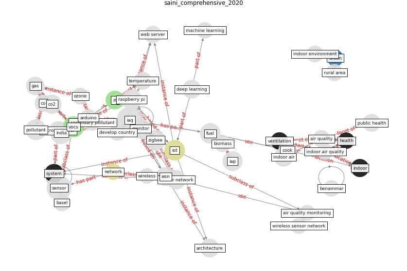

# Article: A comprehensive review on indoor air quality monitoring systems for enhanced public health (saini_comprehensive_2020)

* Source: [10.1186/s42834-020-0047-y](https://doi.org/10.1186/s42834-020-0047-y)
* Year: 2020
* Cluster: [air-ventilation](cluster_13)

## Keywords

 * [air conditioning](keyword_air_conditioning), [air pollution](keyword_air_pollution), air quality, air quality monitoring, application layer, [architecture](keyword_architecture), arduino, arduino uno, asthma, atmos, [australia](keyword_australia), basel, benammar, biomass, biomass fuel, c air, chandigarh, chemical product, [china](keyword_china), [city](keyword_city), [co](keyword_co), co2, coal, combustion, cook, cooking system, [deep learning](keyword_deep_learning), develop country, electronic nose, [energy](keyword_energy), fuel, gas, gas sensor, gaseous pollutant, [health](keyword_health), [human health](keyword_human_health), hwang, iap, [iaq](keyword_iaq), iaq monitoring, [india](keyword_india), [indoor](keyword_indoor), indoor air, indoor air pollution, [indoor air quality](keyword_indoor_air_quality), indoor air quality monitoring, [indoor environment](keyword_indoor_environment), [iot](keyword_iot), iot architecture, kerosene, [machine learning](keyword_machine_learning), mcu, microcontroller, mobile app, [model](keyword_model), [monitor](keyword_monitor), monitoring system, morbidity, moreno rangel, [mortality](keyword_mortality), [network](keyword_network), no2, nox, organ, outdoor air, ozone, parajuli, pillai, [pollutant](keyword_pollutant), power consumption, [public health](keyword_public_health), raspberry pi, [research](keyword_research), [researcher](keyword_researcher), rh, roser m, rural area, secondary pollutant, sense, [sensor](keyword_sensor), sensor network, sensor nod, [simulation](keyword_simulation), sm, statistic, [symptom](keyword_symptom), [system](keyword_system), [technology](keyword_technology), [temperature](keyword_temperature), traditional cooking system, [urban](keyword_urban), [urban area](keyword_urban_area), [ventilation](keyword_ventilation), voc, [vocs](keyword_vocs), web server, wireless, wireless sensor network, wsn, [zigbee](keyword_zigbee)

## Concepts

 

## Neighbours

### Closest articles

* Scalable IoT Architecture for Monitoring IEQ Conditions in Public and Private Buildings - [LINK](article_calvo_scalable_2022)
* Continuous IEQ monitoring system: Context and development - [LINK](article_parkinson_continuous_2019)
* An Intelligent IEQ Monitoring and Feedback System: Development and Applications - [LINK](article_geng_intelligent_2021)
* The contribution of green buildings in the fight against COVID-19 - [LINK](article_world_green_building_council_contribution_2020)
*  - [LINK](article_yakubu_aminu_dodo_green_2020)
* Designing a Multi-Agent Occupant Simulation System to Support Facility Planning and Analysis for COVID-19 - [LINK](article_lee_designing_2021)
* Emerging from Lockdown: CIBSE COVID-19 Guidance - [LINK](article_cibse_emerging_2020)
* Smart buildings: how a virus might lead to healthier buildings - Arup - [LINK](article_lam_smart_2021)

### Closest BPs

* Blueprint: Indoor Environmental Quality (IEQ) monitoring system - [LINK](bp_3)
* Blueprint: Building Adaptation during a pandemic - [LINK](bp_14)
* Blueprint: Architecture design - [LINK](bp_2)
