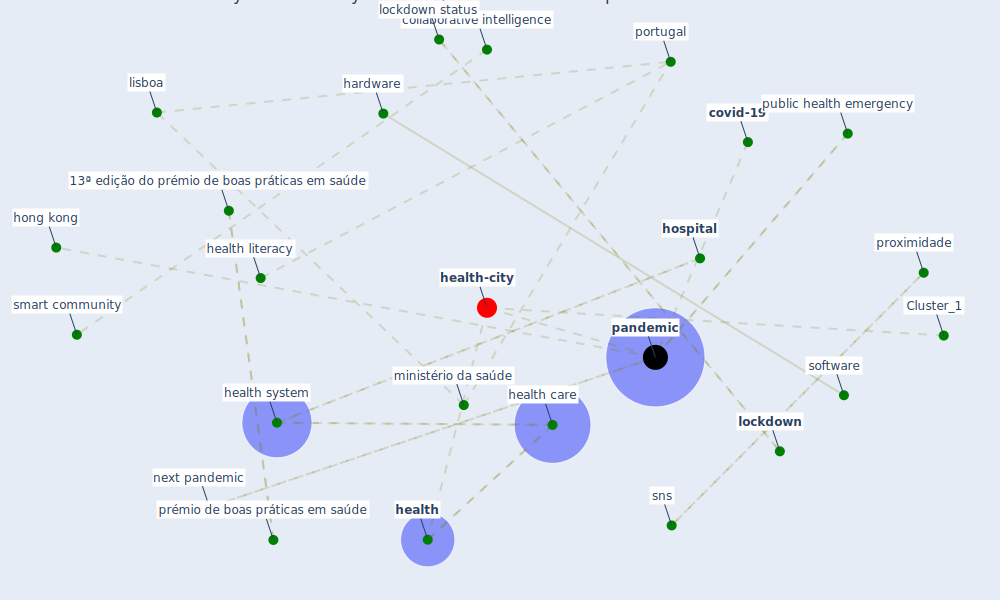

# Article: From Viral City to Smart City: Learning from Pandemic Experiences (sakellarides_viral_2020)

* Source: [10.20344/amp.13841](https://doi.org/10.20344/amp.13841)
* Year: 2020
* Cluster: [urban-city](cluster_6)

## Keywords

 * 13ª edição do prémio de boas práticas em saúde, aceite, acute, authoritarian, autor correspondente, bergamo, brambillasca p, budget, catedrático jubilado, [china](keyword_china), [city](keyword_city), collaboration, collaborative intelligence, [community](keyword_community), community health, community health intelligence, community network, competition, constantino, cooperation, [coronavirus](keyword_coronavirus), coronavirus epidemic, covid 19 epidemic outbreak, [covid-19](keyword_covid-19), current outbreak, current pandemic, distribution, durán, elderly, [epidemic](keyword_epidemic), [epidemiology](keyword_epidemiology), flu city, flu city smart city, gate b, [government](keyword_government), hardware, [health](keyword_health), [health care](keyword_health_care), health literacy, [health system](keyword_health_system), [healthcare](keyword_healthcare), healthcare professional, hj, [hong kong](keyword_hong_kong), [hospital](keyword_hospital), in press, information gathering, ingenuity, [innovation](keyword_innovation), integrate care, intelligence, [italy](keyword_italy), leisure time, [lisboa](keyword_lisboa), lissa, [lockdown](keyword_lockdown), lockdown status, [london](keyword_london), ministério da saúde, miranda d, mudança centrada nas pessoas, nacoti, nacoti m, new zealand, next outbreak, next pandemic, next war, obligation, oseltamivir, [outbreak](keyword_outbreak), palgrave macmillan, pandemia, [pandemic](keyword_pandemic), pandemic preparedness, pandemic threat, pandora s box, pessoas, population dynamic, port j, [portugal](keyword_portugal), press, professor, proximidade, prémio de boas práticas em saúde, [public health](keyword_public_health), public health crisis, public health emergency, public health threat, recebido, redemption, [smart city](keyword_smart_city), smart community, sns, software, stop some activity for good, trust, universidade nova de lisboa, [wellbee](keyword_wellbee), [work](keyword_work), wright

## Concepts

 

## Neighbours

### Closest articles

* Amplifying the role of knowledge translation platforms in the COVID-19 pandemic response - [LINK](article_el-jardali_amplifying_2020)
* Health, Economic and Social Development Challenges of the COVID-19 Pandemic: Strategies for Multiple and Interconnected Issues - [LINK](article_panneer_health_2022)
* Impact of COVID-19 on IoT Adoption in Healthcare, Smart Homes, Smart Buildings, Smart Cities, Transportation and Industrial IoT - [LINK](article_umair_impact_2021)
* 10 Adaptive Measures for Public Places to face the COVID 19 Pandemic Outbreak - [LINK](article_cheshmehzangi_10_2020)
* Sustainable work throughout the life course: National policies and strategies, Publications Office of the European Union - [LINK](article_eurofund_sustainable_2016)
* The COVID-19 pandemic: Lessons on building more equal and sustainable societies - [LINK](article_van_barneveld_covid-19_2020)
* Urban planning after COVID-19 - [LINK](article_rtpi_urban_2021)
* COVID-19 and the UN Sustainable Development Goals: Threat to Solidarity or an Opportunity? - [LINK](article_leal_filho_covid-19_2020)
* The City Under COVID‐19: Podcasting As Digital Methodology - [LINK](article_rogers_city_2020)

### Closest BPs

* Blueprint: Smart Locker System - [LINK](bp_1)
* Blueprint: Resilience in staffing and skills training - [LINK](bp_12)
* Blueprint: Tracking and enforcing use of Personal Protective Equipment - [LINK](bp_23)
