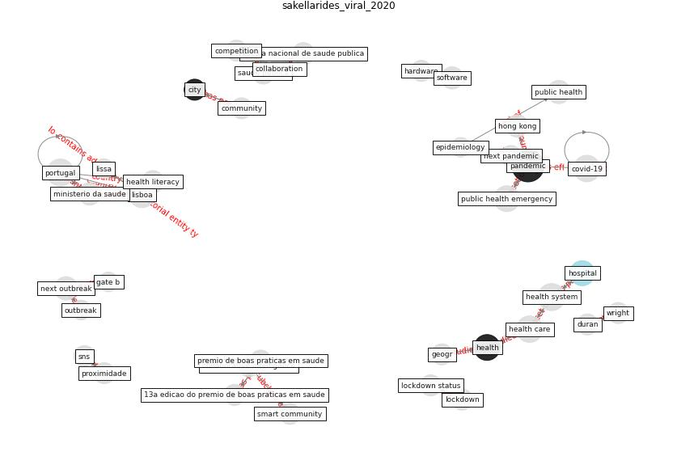

# Article: From Viral City to Smart City: Learning from Pandemic Experiences (sakellarides_viral_2020)

* Source: [10.20344/amp.13841](https://doi.org/10.20344/amp.13841)
* Year: 2020
* Cluster: [health-pandemic](cluster_4)

## Keywords

 * 13ª edição do prémio de boas práticas em saúde, acute, animal specie, autor correspondente, baixa, barómetro, bergamo, brambillasca p, budget, [china](keyword_china), [city](keyword_city), collaboration, collaborative intelligence, [community](keyword_community), community health intelligence, community network, competition, constantino, cooperation, [coronavirus](keyword_coronavirus), [covid-19](keyword_covid-19), current outbreak, current pandemic, digital revolution, durán, elderly, [epidemic](keyword_epidemic), [epidemiology](keyword_epidemiology), escola nacional de saúde pública, european, financial time, flu city, gary liu 6, gate b, global economy, [government](keyword_government), hardware, [health](keyword_health), [health care](keyword_health_care), health literacy, [health system](keyword_health_system), [healthcare](keyword_healthcare), healthcare professional, hj, [hong kong](keyword_hong_kong), [hospital](keyword_hospital), [human](keyword_human), in press, information gathering, [innovation](keyword_innovation), integrate care, [intelligence](keyword_intelligence), [italy](keyword_italy), leisure time, lisboa, lissa, [lockdown](keyword_lockdown), lockdown status, [london](keyword_london), ministério da saúde, miranda d, mudança centrada nas pessoas, nacoti, nacoti m, national health service, next outbreak, next pandemic, obligation, opinião social covid 19, oseltamivir, [outbreak](keyword_outbreak), palgrave macmillan, pandemia, [pandemic](keyword_pandemic), pandemic preparedness, pandora s box, port j, [portugal](keyword_portugal), press, professor, projeto piloto de prescrição social de lisboa, proximidade, prémio de boas práticas em saúde, [public health](keyword_public_health), public health crisis, public health emergency, public health threat, redemption, saúde pública, second generation, [smart city](keyword_smart_city), smart community, sns, software, trust, universidade nova de lisboa, usf da baixa, [work](keyword_work), [world heritage site](keyword_world_heritage_site), wright

## Concepts

 

## Neighbours

### Closest articles

* Amplifying the role of knowledge translation platforms in the COVID-19 pandemic response - [LINK](article_el-jardali_amplifying_2020)
* Organizations’ Management of the COVID-19 Pandemic: A Scoping Review of Business Articles - [LINK](article_boiral_organizations_2021)
* Seeing the invisible hand: Underlying effects of COVID-19 on tourists’ behavioral patterns - [LINK](article_li_seeing_2020)
* Should I Stay or Should I Go? Tourists’ COVID-19 Risk Perception and Vacation Behavior Shift - [LINK](article_bratic_should_2021)
* Responsible Transport: A post-COVID agenda for transport policy and practice - [LINK](article_budd_responsible_2020)
* Mobility Behaviour in View of the Impact of the COVID-19 Pandemic—Public Transport Users in Gdansk Case Study - [LINK](article_przybylowski_mobility_2021)
* A study on office workplace modification during the COVID-19 pandemic in The Netherlands - [LINK](article_hou_study_2021)
* Startups in times of crisis – A rapid response to the COVID-19 pandemic - [LINK](article_kuckertz_startups_2020)
* The impacts of knowledge, risk perception, emotion and information on citizens’ protective behaviors during the outbreak of COVID-19: a cross-sectional study in China - [LINK](article_ning_impacts_2020)
* <scp>COVID</scp>             ‐19: Small and medium enterprises challenges and responses with creativity, innovation, and entrepreneurship - [LINK](article_thukral_covid19_2021)

### Closest BPs

* Blueprint: Air Cleaning Plants - [LINK](bp_15)
* Blueprint: Tender support at building stage - [LINK](bp_9)
* Blueprint: Building Adaptation during a pandemic - [LINK](bp_14)
