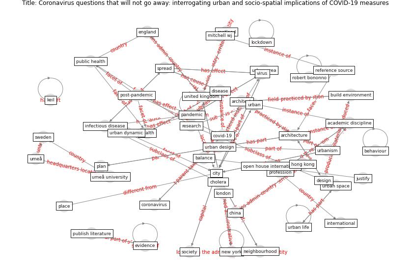

# Article: __Coronavirus questions that will not go away: interrogating urban and socio-spatial implications of COVID-19 measures__ (salama_coronavirus_2020)

* [10.35241/emeraldopenres.13561.1](https://doi.org/10.35241/emeraldopenres.13561.1)
* Cluster: [space-urban](cluster_13)

## Keywords

[coronavirus](keyword_coronavirus), [city](keyword_city), [pandemic](keyword_pandemic)

## Abstract

The highly contagious coronavirus and the rapid spread of
COVID-19 disease have generated a global public health
crisis, which is being addressed at various local and
global scales through social distancing measures and
guidelines. This is coupled with debates about the nature
of living and working patterns through intensive
utilisation of information and telecommunication
technologies, leading to the social and institutional
acceptability of these patterns as the ‘new normal.’ 
The primary objective of this article is to instigate a
discourse about the potential contribution of architecture
and urban design and planning in generating knowledge that
responds to pressing questions about future considerations
of post pandemic architecture and urbanism.
Methodologically, the discussion is based on a
trans-disciplinary framework, which is utilised for
conceptual analysis and is operationalized by identifying
and discoursing design and planning implications. The
article underscores relevant factors; originates insights
for areas where future research will be critically needed,
through key areas: a) Issues related to urban dynamics are
delineated from the perspective of urban and human
geography, urban design and planning, and transportation
engineering; b) Questions that pertain to socio-spatial
implications and urban space/ urban life dialectics stem
from the field of environmental psychology; and c)
Deliberations about new environments that accommodate new
living/working styles supervene from ethnographical and
anthropological perspectives.  The article concludes with
an outlook that captures key aspects of the needed synergy
between architectural and urban education, research, and
practice and public health in a post pandemic virtual and
global world.

## Concepts

 

