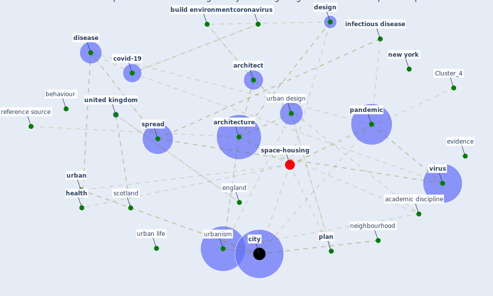

# Article: Coronavirus questions that will not go away: interrogating urban and socio-spatial implications of COVID-19 measures (salama_coronavirus_2020)

* Source: [10.35241/emeraldopenres.13561.1](https://doi.org/10.35241/emeraldopenres.13561.1)
* Year: 2020
* Cluster: [urban-city](cluster_6)

## Keywords

 * I, I ridda, academic discipline, anthropological, [architect](keyword_architect), [architecture](keyword_architecture), [australia](keyword_australia), balance, behaviour, [build](keyword_build), [build environment](keyword_build_environment), cambridge, [china](keyword_china), [cholera](keyword_cholera), [city](keyword_city), compete interest, [coronavirus](keyword_coronavirus), coronavirus disease, [covid-19](keyword_covid-19), current, current literature, [design](keyword_design), [disease](keyword_disease), dissent, earth observatory, england, ethnographical, [evidence](keyword_evidence), expertise, gold coast, healing, [health](keyword_health), high live standard city, highly contagious, [home](keyword_home), [hong kong](keyword_hong_kong), [infection](keyword_infection), [infectious disease](keyword_infectious_disease), international, ireland, [italy](keyword_italy), justify, keil, literature, [lockdown](keyword_lockdown), [london](keyword_london), m begin, mit press, mitchell wj, movement, nasa, neighbourhood, [new york](keyword_new_york), no compete interest, open house international, [pandemic](keyword_pandemic), [place](keyword_place), place make, [plan](keyword_plan), planner, post-pandemic, practice, profession, [public health](keyword_public_health), public health england, public transit, publish literature, reference source, [research](keyword_research), robert bononno, salama be, scientific standard, scotland, [social](keyword_social), [society](keyword_society), socio spatial, [solution](keyword_solution), [spread](keyword_spread), [sweden](keyword_sweden), trans disciplinarity, [travel](keyword_travel), triadic relationship, tzadik, umeå, umeå university, [united kingdom](keyword_united_kingdom), [united nations](keyword_united_nations), [urban](keyword_urban), urban area, urban design, urban design and planning, urban dynamic, urban environment, urban form, urban life, urban space, [urbanism](keyword_urbanism), [virus](keyword_virus), wale, [world health organization](keyword_world_health_organization)

## Concepts

 

## Neighbours

### Closest articles

* Respiratory pandemics, urban planning and design: A multidisciplinary rapid review of the literature - [LINK](article_harris_respiratory_2022)
* Epidemics, Planning and the City: A Special Issue of Planning Perspectives - [LINK](article_davis_epidemics_2022)
* The Role of Architecture and Urbanism in Preventing Pandemics - [LINK](article_kumar_role_2021)
* COVID-19 Pandemic: Rethinking Strategies for Resilient Urban Design, Perceptions, and Planning - [LINK](article_afrin_covid-19_2021)
* COVID-19: Lessons for an Urban(izing) World - [LINK](article_acuto_covid-19_2020)
* The COVID-19 pandemic: Impacts on cities and major lessons for urban planning, design, and management - [LINK](article_sharifi_covid-19_2020)
* Impact of Covid-19 on the built environment - [LINK](article_mahima_impact_2022)
* Antivirus-built environment: Lessons learned from Covid-19 pandemic - [LINK](article_megahed_antivirus-built_2020)
* Pandemic stricken cities on lockdown. Where are our planning and design professionals [now, then and into the future]? - [LINK](article_allam_pandemic_2020)

### Closest BPs

* Blueprint: Smart Locker System - [LINK](bp_1)
* Blueprint: Tracking and enforcing use of Personal Protective Equipment - [LINK](bp_23)
* Blueprint: Mental health – Act: Do something - [LINK](bp_18)
