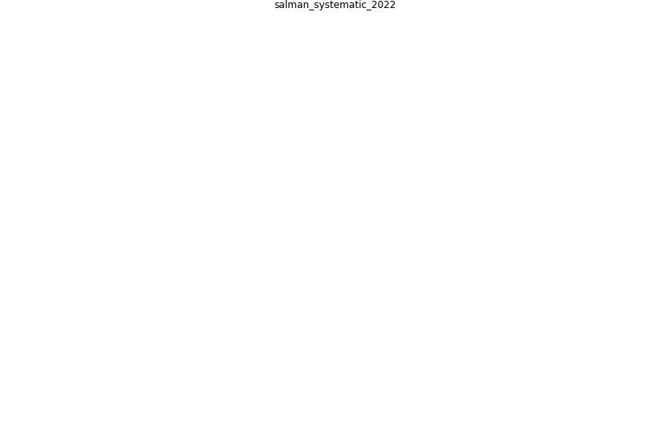

# Article: __A systematic review of building systems and technologies to mitigate the spread of airborne viruses__ (salman_systematic_2022)

* [10.1108/JFM-01-2021-0015](https://doi.org/10.1108/JFM-01-2021-0015)

## Keywords

## Abstract

Purpose The purpose of this study is to conduct a rigorous
systematic literature review and present a summary of
building systems and technologies that can be used to
mitigate the spread of airborne viruses. With the recent
outbreak of COVID-19, occupants’ health and indoor air
quality (IAQ) have become a critical issue for facility
managers to maintain the full functionality of the
buildings. An improved understanding of these available
systems will help facility managers and building owners to
protect the health and safety of building occupants.

Design/methodology/approach The PRISMA protocol was used
for defining the literature search methodology. The concept
mapping technique was used for determining the keywords.
The keywords were then used to search for relevant articles
using the Scopus database and Google Scholar. A thorough
bibliometric analysis and qualitative analysis were
conducted for the selected publications.

Findings It was found that sensor technologies, botanical
air-filtration systems and artificial intelligence could be
used to effectively monitor and improve IAQ. In addition,
natural ventilation is one of the low-cost and effective
methods of reducing contaminants from the indoor air.
Computational fluid dynamic modeling can be used to
understand the flow of virus particles within the building
through the heating, ventilation and air-conditioning
(HVAC) system. Several changes to the HVAC system are also
discussed.

Originality/value This study contains a diversity of
methods from the existing literature that were
systematically selected to present the state-of-the-art
building systems and technologies that can effectively
improve IAQ. The researchers plan to follow up on the
findings of this research and will conduct an empirical
study to assess its impact on IAQ.

## Concepts

 

### References 

* [Rapid expansion of temporary, reliable airborne-infection
isolation rooms with negative air machines for critical
COVID-19 patients](article_lee_rapid_2020)
* [How can airborne transmission of COVID-19 indoors be
minimised?](article_morawska_how_2020)
* [Air, Surface Environmental, and Personal
Protective Equipment Contamination by Severe
Acute Respiratory Syndrome Coronavirus 2
(SARS-CoV-2) From a Symptomatic Patient](article_ong_air_2020)
* [Continuous IEQ monitoring system: Context and
development](article_parkinson_continuous_2019)

### Cited by 

