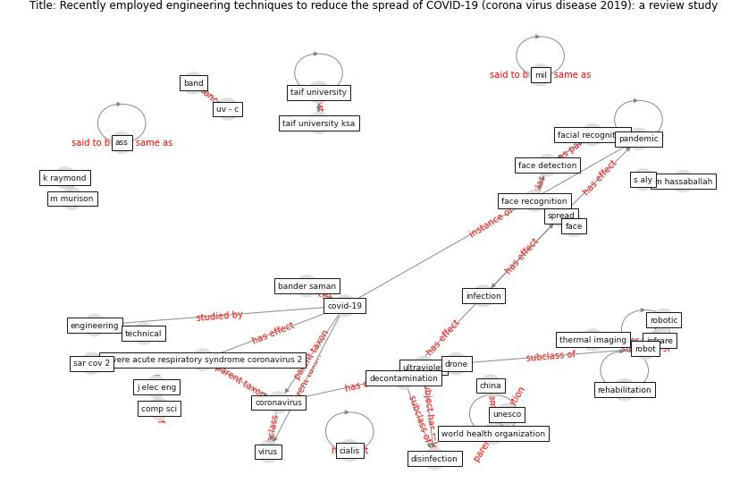

# Article: __Recently employed engineering techniques to reduce the spread of COVID-19 (corona virus disease 2019): a review study__ (saman_recently_2021)

* [10.11591/ijeecs.v22.i1.pp277-286](https://doi.org/10.11591/ijeecs.v22.i1.pp277-286)
* Cluster: [air-ventilation](cluster_8)

## Keywords

[online](keyword_online), [coronavirus](keyword_coronavirus), [virus](keyword_virus), [robot](keyword_robot), [pandemic](keyword_pandemic), [drone](keyword_drone)

## Abstract

\textlessspan\textgreaterThe main challenges of
today’s global health care system are to reach to strong
healthcare system, to provide effective methods to
eliminate the increase in the number of dead and infected
with virus of COVID-19. Therefore, during the last few
months, the great importance and efficacy of a variety of
engineering techniques that have greatly contributed in
curbing the spread of the COVID-19, and evenly help to
eliminate it according to recent scientific studies was
highly prominent. Among these promising technologies in
this field we mention, but not limited to, the use of
ultraviolet (UV) rays to disinfection of air and surfaces.
In addition, thermal imaging technology, which was employed
using infrared radiation for monitoring people in crowded
areas and human groups to determine who have abnormal
temperatures, so that all preventive measures are taken.
Robots have also been used and harnessed to perform many
tasks that limit the spread of the virus and maintain the
integrity of the human element. Last but not least, facial
recognition techniques have also been used to limit the
spread of this pandemic. Ultraviolet radiation is one of
physical therapy modalities that can be used to increase
the efficiency of human immune system to fight the virus.
In conclusion UV radiation, infrared thermal imaging,
robotics, AFR technologies are now widely used to reduce
the spread of this virus and manage the
outbreak.\textless/span\textgreater

## Concepts

 

