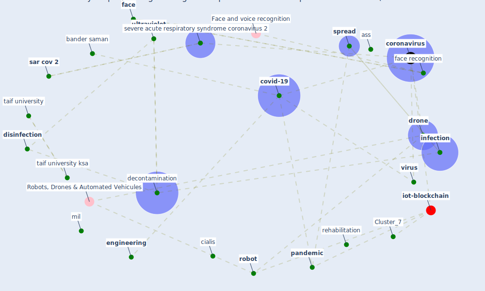

# Article: Recently employed engineering techniques to reduce the spread of COVID-19 (corona virus disease 2019): a review study (saman_recently_2021)

* Source: [10.11591/ijeecs.v22.i1.pp277-286](https://doi.org/10.11591/ijeecs.v22.i1.pp277-286)
* Year: 2021
* Cluster: [iot-blockchain](cluster_7)

## Keywords

 * airplane, ass, automobile, band, bander saman, bbc, block diagram, body temperature, cabin, [china](keyword_china), cialis, [control](keyword_control), coronaviridae, [coronavirus](keyword_coronavirus), coronaviruse, covid 19 coronavirus, [covid-19](keyword_covid-19), dark, [decontamination](keyword_decontamination), [disease](keyword_disease), [disinfect](keyword_disinfect), [disinfection](keyword_disinfection), dna, [drone](keyword_drone), eastern mediterranean africa, egypt, electromagnetic spectrum, [engineering](keyword_engineering), [face](keyword_face), face detection, face mask, [face recognition](keyword_face_recognition), [fever](keyword_fever), [genome](keyword_genome), health care system, [healthcare](keyword_healthcare), hosp, human element, identification, increase their number, [infection](keyword_infection), infrare, [iot](keyword_iot), k raymond, light, light emit device, m hassaballah, m murison, [machine learning](keyword_machine_learning), machine recognition, [microorganism](keyword_microorganism), mil, [monitor](keyword_monitor), mouth, nucleic acid, ozone layer, p d, [pandemic](keyword_pandemic), public transportation, radiation, rehabilitation, [robot](keyword_robot), [robotic](keyword_robotic), s aly, s t, [sar cov 2](keyword_sar_cov_2), science, science journal, [sensor](keyword_sensor), severe acute respiratory syndrome coronavirus 2, skin cancer, [spread](keyword_spread), sunburn, [symptom](keyword_symptom), [taif university](keyword_taif_university), taif university ksa, technical, [temperature](keyword_temperature), thermography, thermometer, [ultraviolet](keyword_ultraviolet), ultravoilet, [unesco](keyword_unesco), [united kingdom](keyword_united_kingdom), university of connecticut, [uv](keyword_uv), [uv light](keyword_uv_light), uv radiation, uv ray, [uv-c](keyword_uv-c), uva, uvb, [virus](keyword_virus), visible light, vitamin d, vol 46 no 7, vol sci, werobotic, [world health organization](keyword_world_health_organization), [world heritage site](keyword_world_heritage_site)

## Concepts

 

## Neighbours

### Closest articles

* Efficacy of an Automated Multiple Emitter Whole-Room Ultraviolet-C Disinfection System Against Coronaviruses MHV and MERS-CoV - [LINK](article_bedell_efficacy_2016)
* Far-UVC light (222 nm) efficiently and safely inactivates airborne human coronaviruses - [LINK](article_buonanno_far-uvc_2020)
* Effect of Ultraviolet Germicidal Irradiation on Viral Aerosols - [LINK](article_walker_effect_2007)
* Upper-room ultraviolet air disinfection might help to reduce COVID-19 transmission in buildings: a feasibility study - [LINK](article_beggs_upper-room_2020)
* Upper-Room Ultraviolet Light and Negative Air Ionization to Prevent Tuberculosis Transmission - [LINK](article_escombe_upper-room_2009)
* Behind the Update: ASHRAE Handbook Chapters on UV-C to Include Updated Best Practices, Guidance - [LINK](article_ashrae_behind_2020)
* How Can Blockchain Help People in the Event of Pandemics Such as the COVID-19? - [LINK](article_chang_how_2020)
* Applications of ultraviolet germicidal irradiation disinfection in health care facilities: Effective adjunct, but not stand-alone technology - [LINK](article_memarzadeh_applications_2010)

### Closest BPs

* Blueprint: Installing UV in ductwork - [LINK](bp_10)
* Blueprint: Negative pressure rooms - [LINK](bp_13)
* Blueprint: Resilience in staffing and skills training - [LINK](bp_12)
