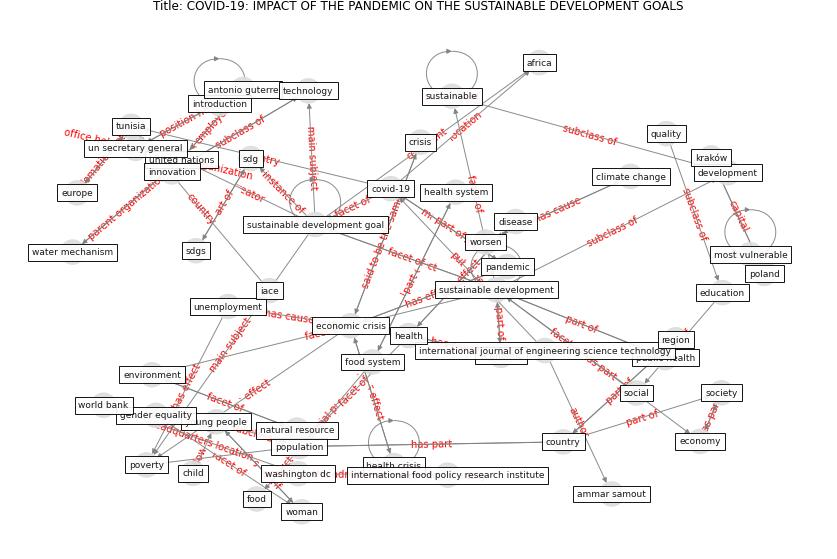

# Article: COVID-19: IMPACT OF THE PANDEMIC ON THE SUSTAINABLE DEVELOPMENT GOALS (samout_covid-19_2020)

* Source: [10.29121/ijoest.v4.i5.2020.117](https://doi.org/10.29121/ijoest.v4.i5.2020.117)
* Year: 2020
* Cluster: [health-pca](cluster_9)

## Keywords

 * 3 4 trillion, aacknowledgment, [africa](keyword_africa), ammar samout, antonio guterre, border, child, [china](keyword_china), [climate change](keyword_climate_change), [country](keyword_country), [covid 19 pandemic](keyword_covid_19_pandemic), [covid-19](keyword_covid-19), [crisis](keyword_crisis), degradation of the biosphere, [development](keyword_development), [disease](keyword_disease), [economic](keyword_economic), economic crisis, economic operator, [economy](keyword_economy), [education](keyword_education), effort to fight poverty, electricity, electricity bill, [environment](keyword_environment), environmental, [epidemic](keyword_epidemic), [europe](keyword_europe), food, food insecurity, food system, future generation, gender equality, [global](keyword_global), global economic and social crisis, global health system, global warming, goal 4, [health](keyword_health), [health care](keyword_health_care), health crisis, health risk behavior, [health system](keyword_health_system), health system collapse, [hospital](keyword_hospital), iace, inclusive, [innovation](keyword_innovation), institute pasteur of tunis, international food policy research institute, international journal of engineering science technology, international monetary fund, introduction, [knowledge](keyword_knowledge), kraków, long term, medical student, most vulnerable, nation, natural resource, [need](keyword_need), no poverty, none, [pandemic](keyword_pandemic), paris climate agreement, [plan](keyword_plan), planning mechanism, [poland](keyword_poland), poor, [population](keyword_population), poverty, [public health](keyword_public_health), quality, region, sanitation, [sdg](keyword_sdg), [sdgs](keyword_sdgs), [social](keyword_social), [society](keyword_society), solidarity, [sustainable](keyword_sustainable), [sustainable development](keyword_sustainable_development), [sustainable development goal](keyword_sustainable_development_goal), sustainable development goal 5, sustainabledevelopment, [technology](keyword_technology), the pandemic, tunisia, un secretary general, unemployment, [united nations](keyword_united_nations), [washington dc](keyword_washington_dc), water mechanism, [woman](keyword_woman), [work](keyword_work), [world bank](keyword_world_bank), world commission on environment and development, [world health organization](keyword_world_health_organization), worsen, young people

## Concepts

 

## Neighbours

### Closest articles

* How COVID-19 Redefines the Concept of Sustainability - [LINK](article_hakovirta_how_2020)
* Building up an ecologically sustainable and socially desirable post-COVID-19 future - [LINK](article_duflot_building_2021)
* COVID-19 and the UN Sustainable Development Goals: Threat to Solidarity or an Opportunity? - [LINK](article_leal_filho_covid-19_2020)
* A critical analysis of the impacts of COVID-19 on the global economy and ecosystems and opportunities for circular economy strategies - [LINK](article_ibn-mohammed_critical_2021)
* The COVID-19 pandemic: Lessons on building more equal and sustainable societies - [LINK](article_van_barneveld_covid-19_2020)
* Health, Economic and Social Development Challenges of the COVID-19 Pandemic: Strategies for Multiple and Interconnected Issues - [LINK](article_panneer_health_2022)
* The socio-economic implications of the coronavirus pandemic (COVID-19): A review - [LINK](article_nicola_socio-economic_2020)
* Sustainable work throughout the life course: National policies and strategies, Publications Office of the European Union - [LINK](article_eurofund_sustainable_2016)
* Impact of COVID-19 on IoT Adoption in Healthcare, Smart Homes, Smart Buildings, Smart Cities, Transportation and Industrial IoT - [LINK](article_umair_impact_2021)
* Mapping research in logistics and supply chain management during COVID-19 pandemic - [LINK](article_montoya-torres_mapping_2021)

### Closest BPs

* Blueprint: Smart Locker System - [LINK](bp_1)
* Blueprint: One-way mobility circulation - [LINK](bp_4)
* Blueprint: Rotational Shift System - [LINK](bp_0)
