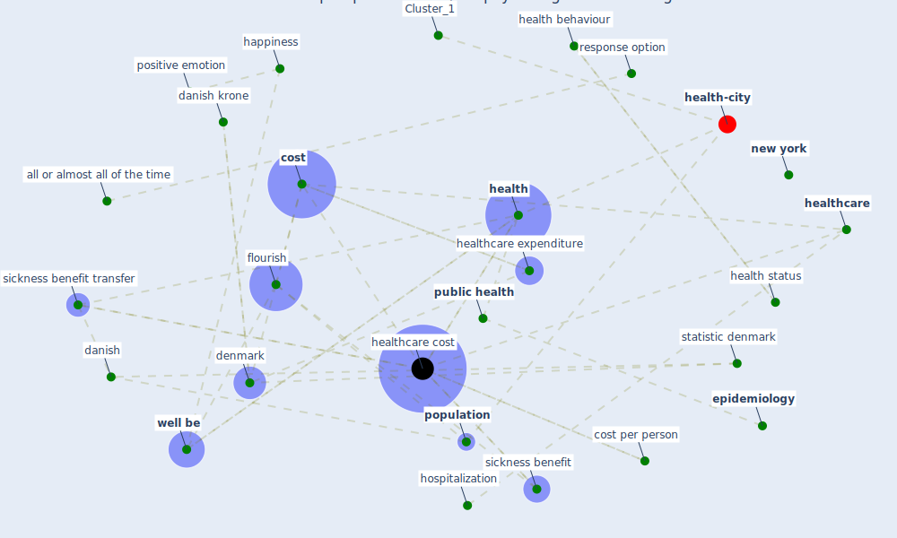

# Article: Mental health economics: A prospective study on psychological flourishing and associations with healthcare costs and sickness benefit transfers in Denmark (santini_mental_2021)

* Source: [10.1016/j.mhp.2021.200222](https://doi.org/10.1016/j.mhp.2021.200222)
* Year: 2021
* Cluster: [health-city](cluster_1)

## Keywords

 * 95 ci, all or almost all of the time, [anxiety](keyword_anxiety), b briggs a o hagan a thompson s, bef5, [berlin](keyword_berlin), categorical, clark a, comorbidity level, condition, [consent](keyword_consent), [cost](keyword_cost), cost per person, [danish](keyword_danish), danish krone, [datum](keyword_datum), deaton, [denmark](keyword_denmark), diener, epidemiologist, [epidemiology](keyword_epidemiology), eudaimonic well be, [europe](keyword_europe), european, european commission, expenditure, extensive margin, extrapolate population cost, [finland](keyword_finland), flour ishe, [flourish](keyword_flourish), [germany](keyword_germany), [gps](keyword_gps), happiness, [health](keyword_health), health behaviour, health economic, health insurance, health status, [healthcare](keyword_healthcare), [healthcare cost](keyword_healthcare_cost), healthcare expenditure, healthcare service, healthcare utilization, hedonic well be, herrin, hospitalization, income, intensive margin, intervention, kahneman, lapland, likert scale, long term, lyubomirsky, [manhattan](keyword_manhattan), mark n, martelin, model 2, most of the time, [new york](keyword_new_york), [new york city](keyword_new_york_city), nielsen, none or almost none of the time, note, p 0 05, patient center, [policy](keyword_policy), pope, [population](keyword_population), positive emotion, probability, psychiatric, psychiatric condition, [public health](keyword_public_health), purchasing power parity, reinikainen, response option, roy, rula, scandinavia, schofield, selection bias, self esteem, sickness benefit, [sickness benefit transfer](keyword_sickness_benefit_transfer), some of the time, statbank, statistic denmark, statistically significant, subjective well be, tertiary education, threshold level, u s dollar, [united kingdom](keyword_united_kingdom), van lente, weekly, [well be](keyword_well_be), [wellbee](keyword_wellbee), [world health organization](keyword_world_health_organization)

## Concepts

 

## Neighbours

### Closest articles

* COVID-19 and social inequalities: a complex and dynamic interaction - [LINK](article_quantin_covid-19_2022)
* Home garden use during COVID-19: Associations with physical and mental wellbeing in older adults - [LINK](article_corley_home_2021)
* Mental health and COVID-19 - [LINK](article_who_mental_2021)
* The socio-economic determinants of COVID-19: A spatial analysis of German county level data - [LINK](article_ehlert_socio-economic_2021)
* Mental Health and the Covid-19 Pandemic - [LINK](article_pfefferbaum_mental_2020)
* COVID-19 Lockdown: Housing Built Environment’s Effects on Mental Health - [LINK](article_amerio_covid-19_2020)
* The impact of COVID-19 and strategies for mitigation and suppression in low- and middle-income countries - [LINK](article_walker_impact_2020)
* Treating two pandemics for the price of one: Chronic and infectious disease impacts of the built and natural environment - [LINK](article_frank_treating_2021)
* The Socio-Spatial Determinants of COVID-19 Diffusion: The Impact of Globalisation, Settlement Characteristics and Population - [LINK](article_sigler_socio-spatial_2020)
* The impacts of knowledge, risk perception, emotion and information on citizens’ protective behaviors during the outbreak of COVID-19: a cross-sectional study in China - [LINK](article_ning_impacts_2020)

### Closest BPs

* Blueprint: Resilience in staffing and skills training - [LINK](bp_12)
* Blueprint: Installing high-efficiency air filters - [LINK](bp_11)
* Blueprint: Air Cleaning Plants - [LINK](bp_15)
