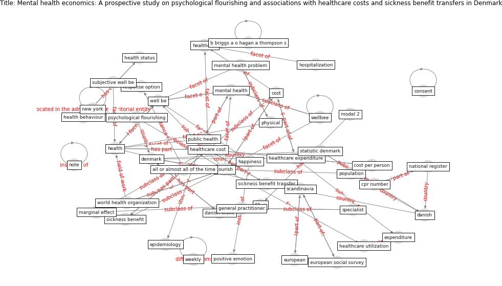

# Article: __Mental health economics: A prospective study on psychological flourishing and associations with healthcare costs and sickness benefit transfers in Denmark__ (santini_mental_2021)

* [10.1016/j.mhp.2021.200222](https://doi.org/10.1016/j.mhp.2021.200222)
* Cluster: [health-building](cluster_9)

## Keywords

* [flourish](keyword_flourish), [healthcare cost](keyword_healthcare_cost), [mental health](keyword_mental_health), [denmark](keyword_denmark), [danish](keyword_danish), [sickness benefit transfer](keyword_sickness_benefit_transfer), [wellbeing](keyword_wellbeing), [public health](keyword_public_health), [danish krone](keyword_danish_krone), [health](keyword_health), happiness, dkk, [cost](keyword_cost), [wellbee](keyword_wellbee), statistic denmark

## Keywords at large

* [flourish](keyword_flourish), [healthcare cost](keyword_healthcare_cost), [mental health](keyword_mental_health), [danish](keyword_danish), [denmark](keyword_denmark), [sickness benefit transfer](keyword_sickness_benefit_transfer), [wellbeing](keyword_wellbeing), [public health](keyword_public_health), [danish krone](keyword_danish_krone), [health](keyword_health)

## Concepts

 

### Closest articles 

* [Home garden use during COVID-19: Associations with physical and mental wellbeing in older adults](article_corley_home_2021)
* [COVID-19 and social inequalities: a complex and dynamic interaction](article_quantin_covid-19_2022)
* [Mental Health and the Covid-19 Pandemic](article_pfefferbaum_mental_2020)
* [Mental health and COVID-19](article_who_mental_2021)
* [Association between indoor-outdoor green features and psychological health during the COVID-19 lockdown in Italy: A cross-sectional nationwide study](article_spano_association_2021)
* [Dangerous liaisons? Applying the social harm perspective to the social inequality, housing and health trifecta during the Covid-19 pandemic](article_gurney_dangerous_2021)
* [Psychological Effects of Home Confinement and Social Distancing Derived from COVID-19 in the General Population—A Systematic Review](article_rodriguez-fernandez_psychological_2021)
* [Eviction, Health Inequity, and the Spread of COVID-19: Housing Policy as a Primary Pandemic Mitigation Strategy](article_benfer_eviction_2021)
* [Treating two pandemics for the price of one: Chronic and infectious disease impacts of the built and natural environment](article_frank_treating_2021)
* [Green in times of COVID-19: urban green space relevance during the COVID-19 pandemic in Buenos Aires City](article_marconi_green_2022)

