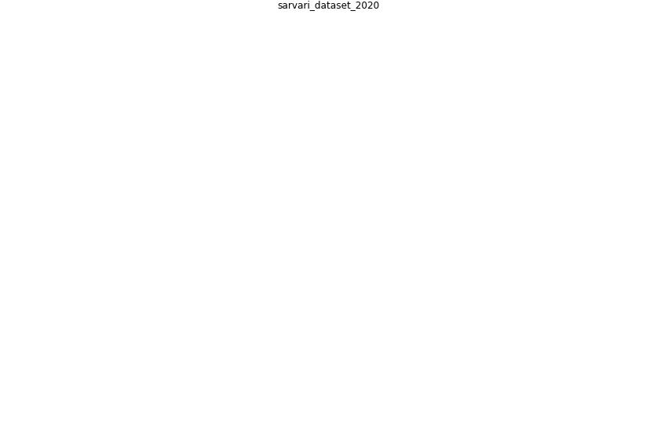

# Article: ____ (sarvari_dataset_2020)

* [10.17632/JTF9D9DYT3.3](https://doi.org/10.17632/JTF9D9DYT3.3)

## Keywords

## Abstract

This dataset was established from an online
questionnaire-based survey to identify effective control
and mitigation measures to prevent the transmission of
COVID-19 in the built environment. The survey was conducted
from 8 April to 25 July 2020.

## Concepts

 

