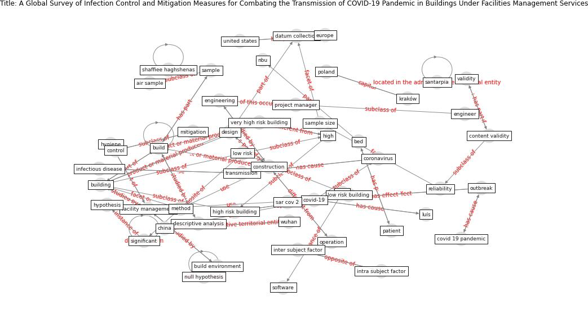

# Article: __A Global Survey of Infection Control and Mitigation Measures for Combating the Transmission of COVID-19 Pandemic in Buildings Under Facilities Management Services__ (sarvari_global_2022)

* [10.3389/fbuil.2021.644104](https://doi.org/10.3389/fbuil.2021.644104)
* Cluster: [building-health](cluster_10)

## Keywords

[construction](keyword_construction), [building](keyword_building), [design](keyword_design), [build](keyword_build), [transmission](keyword_transmission), [coronavirus](keyword_coronavirus), [china](keyword_china)

## Abstract

Facilities management along with health care are two
important aspects in controlling the spread of infectious
diseases with regard to controlling the outbreak of global
COVID-19 pandemic. Hence, with the increasing outbreak of
COVID-19 pandemic, the importance of examining the
relationship between the built environment and the outbreak
of infectious diseases has become more significant. The aim
of the research described in this article is to develop
effective infection control and mitigation measures to
prevent the transmission of COVID-19 pandemic in the built
environment. This study seeks to answer the question of how
the facilities management industry can help reduce the
transmission of coronavirus. For this purpose, an online
survey questionnaire was distributed internationally from 8
April to 25 July, 2020 to collect data from various key
stakeholders. The collected data were analyzed by SPSS
software. Various methods for the prevention and control of
infectious diseases transmission are evaluated through this
questionnaire-based survey with regard to their
effectiveness for the healthy and safe built environment.
These methods were categorized into three groups, including
training protocols, operation and maintenance, and design
and construction. The results show that all suggested
methods have a positive effect on all types of buildings.
These methods have an equal effect on low-risk buildings,
while for high and very high-risk buildings, training
protocols and design and construction measures have the
greatest impact. In addition, training protocols and the
measures in operation and maintenance will have the
greatest effect on medium-risk buildings. The results can
help in more rational decision making in relation to
controlling the outbreak of COVID-19 pandemic in all types
of buildings.

## Concepts

 

### References 

* [Aerosol and Surface Distribution of Severe Acute
Respiratory Syndrome Coronavirus 2 in Hospital
Wards, Wuhan, China, 2020](article_guo_aerosol_2020)
* [Effects of temperature and humidity on the spread of
COVID-19: A systematic review](article_mecenas_effects_2020)
* [Air, Surface Environmental, and Personal
Protective Equipment Contamination by Severe
Acute Respiratory Syndrome Coronavirus 2
(SARS-CoV-2) From a Symptomatic Patient](article_ong_air_2020)
* [COVID-19 Could Leverage a Sustainable Built
Environment](article_pinheiro_covid-19_2020)

### Cited by 

