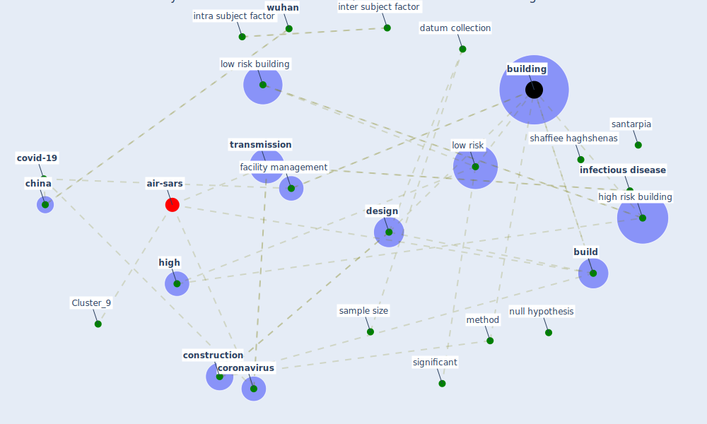

# Article: A Global Survey of Infection Control and Mitigation Measures for Combating the Transmission of COVID-19 Pandemic in Buildings Under Facilities Management Services (sarvari_global_2022)

* Source: [10.3389/fbuil.2021.644104](https://doi.org/10.3389/fbuil.2021.644104)
* Year: 2022
* Cluster: [air-sars](cluster_9)

## Keywords

 * [aerosol](keyword_aerosol), [air](keyword_air), air sample, bed, [build](keyword_build), [build environment](keyword_build_environment), [building](keyword_building), [china](keyword_china), [construction](keyword_construction), content validity, continent, [control](keyword_control), [coronavirus](keyword_coronavirus), covariance matrix, [covid 19 pandemic](keyword_covid_19_pandemic), [covid-19](keyword_covid-19), current generation, datum collection, descriptive analysis, [design](keyword_design), doctor, doctorate, enclose environment, [engineer](keyword_engineer), [engineering](keyword_engineering), error, [europe](keyword_europe), [facility management](keyword_facility_management), frontier in build environment, future generation, ghasemi, hazard, [high](keyword_high), high and very high risk, high risk building, hygiene, hypothesis, [infection](keyword_infection), [infection control](keyword_infection_control), [infectious disease](keyword_infectious_disease), inter subject factor, intra subject factor, kraków, lange salvia, [london](keyword_london), low risk, low risk building, luongo, luís, [maintenance](keyword_maintenance), master s degree, medium risk, mediumrisk building, method, [mitigation](keyword_mitigation), morwitzer, nbu, nourbakhsh, null hypothesis, operation, [outbreak](keyword_outbreak), [patient](keyword_patient), pinheiro, pirouz, [poland](keyword_poland), [population](keyword_population), population size, [prevention](keyword_prevention), project manager, quadratic, quarantine, rahdari, reject, reliability, [research](keyword_research), [sample](keyword_sample), sample size, santarpia, [sar cov 2](keyword_sar_cov_2), shaffiee haghshenas, significant, software, specific, sphericity, [spread](keyword_spread), spss, spss software, sum of square, [surface](keyword_surface), [survey](keyword_survey), [temperature](keyword_temperature), test positive, [transmission](keyword_transmission), type of building, [united kingdom](keyword_united_kingdom), [united states](keyword_united_states), very high risk building, [viral](keyword_viral), [virus](keyword_virus), [wuhan](keyword_wuhan)

## Concepts

 

## Neighbours

### Closest articles

* COVID-19 and a new resilient infrastructure landscape - [LINK](article_oecd_covid-19_2021)
* How the 5G Enabled the COVID-19 Pandemic Prevention and Control: Materiality, Affordance, and (De-)Spatialization - [LINK](article_li_how_2022)
* Design COVID-19 Ontology: A Healthcare and Safety Perspective - [LINK](article_aloulou_design_2022)
* The removal of airborne SARS-CoV-2 and other microbial bioaerosols by air filtration on COVID-19 surge units - [LINK](article_conway-morris_removal_2021)
* COVID-19 as a Harbinger of Transforming Infrastructure Resilience - [LINK](article_carvalhaes_covid-19_2020)
* Real-world data show that filters clean COVID-causing virus from air - [LINK](article_thompson_real-world_2021)
* Guidelines for resilience systems analysis - [LINK](article_oecd_guidelines_2014)
* Preparing critical infrastructure for the future: Lessons learnt from the Covid-19 pandemic - [LINK](article_tomalska_preparing_2022)

### Closest BPs

* Blueprint: Installing high-efficiency air filters - [LINK](bp_11)
* Blueprint: Negative pressure rooms - [LINK](bp_13)
* Blueprint: Air Cleaning Plants - [LINK](bp_15)
