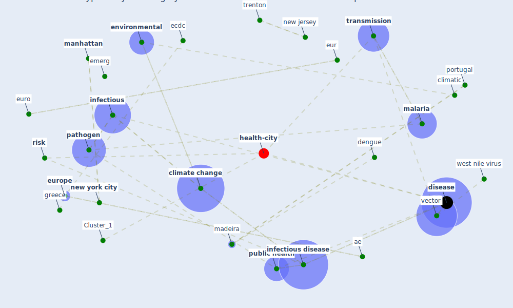

# Article: Prototype Early Warning Systems for Vector-Borne Diseases in Europe (semenza_prototype_2015)

* Source: [10.3390/ijerph120606333](https://doi.org/10.3390/ijerph120606333)
* Year: 2015
* Cluster: [health-city](cluster_1)

## Keywords

 * 26 may 2015, ae, aedes aegypti, aedes albopictus, american airlines, b biol, baka a, case study, central, [china](keyword_china), chotpitayasunondh t, [climate change](keyword_climate_change), climatic, [croatia](keyword_croatia), d j, dengue, dengue virus, [disease](keyword_disease), district, district level, e3, e3 network, eastern europe, ecdc, [ecosystem](keyword_ecosystem), emerg, emerging flaviviruses, [environmental](keyword_environmental), [epidemic](keyword_epidemic), [epidemiological](keyword_epidemiological), [epidemiology](keyword_epidemiology), eur, euro, [europe](keyword_europe), european centre for disease prevention and control, european environment and epidemiology e3 network, [european union](keyword_european_union), eurosurveillance, evros province, forecast and control of epidemics in a globalized world, [france](keyword_france), global, globalization, greece, [health](keyword_health), host, [human health](keyword_human_health), [infect](keyword_infect), [infectious](keyword_infectious), [infectious disease](keyword_infectious_disease), interconnect, interconnect world, ismail h, j c, la ruche, lindgren e, logistic regression, madeira, [malaria](keyword_malaria), malaria in the who european region 1971 1999, malkinson d, [manhattan](keyword_manhattan), [member state](keyword_member_state), [monitor](keyword_monitor), [mosquito](keyword_mosquito), nat, [nature](keyword_nature), neglect, [new jersey](keyword_new_jersey), [new york city](keyword_new_york_city), [outbreak](keyword_outbreak), parasit, [pathogen](keyword_pathogen), paz s, [perspective](keyword_perspective), plos neglect, population density, [portugal](keyword_portugal), [public health](keyword_public_health), public health 2015, [research](keyword_research), [risk](keyword_risk), semenza, [spread](keyword_spread), suk j e, suntayakorn, [surveillance](keyword_surveillance), [survey](keyword_survey), surveyor, [transmission](keyword_transmission), [trenton](keyword_trenton), turkey, [usa](keyword_usa), vec, [vector](keyword_vector), [vector borne disease](keyword_vector_borne_disease), west nile fever, west nile virus, who, zoonotic

## Concepts

 

## Neighbours

### Closest articles

* Addressing vulnerability, building resilience: community-based adaptation to vector-borne diseases in the context of global change - [LINK](article_bardosh_addressing_2017)
* Decision Making within the Built Environment as a Strategy for Mitigating the Risk of Malaria and Other Vector-Borne Diseases - [LINK](article_obonyo_decision_2018)
* The impact of climate change on the epidemiology and control of Rift Valley fever - PubMed - [LINK](article_martin_impact_2008)
* Integrating rapid risk mapping and mobile phone call record data for strategic malaria elimination planning - [LINK](article_tatem_integrating_2014)
* Vector-borne disease, climate change and urban design - [LINK](article_ogden_vector-borne_2016)
* Challenges to Mitigating the Urban Health Burden of Mosquito-Borne Diseases in the Face of Climate Change - [LINK](article_ligsay_challenges_2021)
* Global policy challenges for urban vector-borne disease risks - [LINK](article_alabaster_global_2016)
* Making green infrastructure healthier infrastructure - [LINK](article_lohmus_making_2015)
* Learning from pandemics: Applying resilience thinking to identify priorities for planning urban settlements - [LINK](article_syal_learning_2021)
* COVID-19 Pandemic: Rethinking Strategies for Resilient Urban Design, Perceptions, and Planning - [LINK](article_afrin_covid-19_2021)

### Closest BPs

* Blueprint: Monitoring of wastewater - [LINK](bp_21)
* Blueprint: Air Cleaning Plants - [LINK](bp_15)
* Blueprint: Indoor Environmental Quality (IEQ) monitoring system - [LINK](bp_3)
