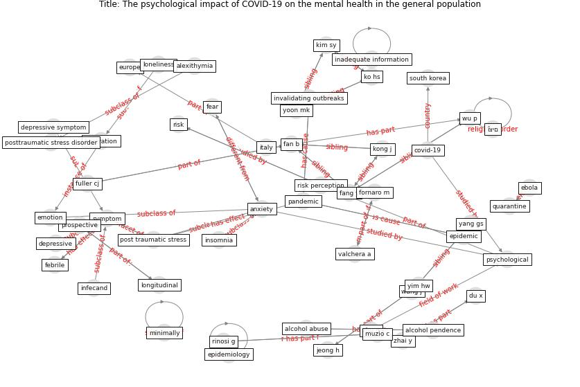

# Article: The psychological impact of COVID-19 on the mental health in the general population (serafini_psychological_2020)

* Source: [10.1093/qjmed/hcaa201](https://doi.org/10.1093/qjmed/hcaa201)
* Year: 2020
* Cluster: [health-mental](cluster_15)

## Keywords

 * acute stress, alcohol abuse, alcohol pendence, alexithymia, anastasia a, [anxiety](keyword_anxiety), anxlease, bai y, chan ly, clinically dysfunctional, [conflict of interest](keyword_conflict_of_interest), costantini l, covid 19 coronavirus, covid 19 infection, [covid-19](keyword_covid-19), cross sectional, deamond sl, dependence, [depressive](keyword_depressive), [depressive symptom](keyword_depressive_symptom), du x, duan l, ebola, emotion, [epidemic](keyword_epidemic), [epidemiology](keyword_epidemiology), [europe](keyword_europe), fan b, fang y, [fear](keyword_fear), febrile, fornaro m, frustration, fuller cj, genoa, h1n1, healthcare professional, horse owners, [hospital](keyword_hospital), hunter j, hyperarousal, inadequate information, infecand, insomnia, invalidating outbreaks, [italy](keyword_italy), jeong h, ke, kim sy, ko hs, koenig kl, kong j, lee s, li w, [loneliness](keyword_loneliness), longitudinal, maunder r, minimally, muzio c, neurosurgery, otsubo y, oxford university press, [pandemic](keyword_pandemic), persars, pompili m, [post traumatic stress](keyword_post_traumatic_stress), post traumatic stress disorder, posttraumatic stress disorder, prospective, protective factor, psychiatric, [psychological](keyword_psychological), [psychosocial](keyword_psychosocial), pts symptoms, ptsd, public health emergency, quarantine, reject, [restriction](keyword_restriction), rinosi g, [risk](keyword_risk), [risk perception](keyword_risk_perception), [sar outbreak](keyword_sar_outbreak), senegal, [south korea](keyword_south_korea), [symptom](keyword_symptom), [toronto](keyword_toronto), valchera a, vellante f, wang j, wang jx, wu p, yang gs, yim hw, yoon mk, zhai y, zhu g, αν, απών, ḯצים

## Concepts

 

## Neighbours

### Closest articles

* Psychological Effects of Home Confinement and Social Distancing Derived from COVID-19 in the General Population—A Systematic Review - [LINK](article_rodriguez-fernandez_psychological_2021)
* Mental Health and the Covid-19 Pandemic - [LINK](article_pfefferbaum_mental_2020)
* Mental health and COVID-19 - [LINK](article_who_mental_2021)
* Home garden use during COVID-19: Associations with physical and mental wellbeing in older adults - [LINK](article_corley_home_2021)
* COVID-19 Lockdown: Housing Built Environment’s Effects on Mental Health - [LINK](article_amerio_covid-19_2020)
* A Mixed Approach on Resilience of Spanish Dwellings and Households during COVID-19 Lockdown - [LINK](article_cuerdo-vilches_mixed_2020)
* Navigating Climate Change: Rethinking the Role of Buildings - [LINK](article_cole_navigating_2020)
* How will COVID-19 change future building regulations? - [LINK](article_hmc_architects_how_2020)
* COVID-19 Lessons for a Resilient Built Environment: A Roadmap - [LINK](article_hull_covid-19_2020)
* Will a pandemic change building codes? - [LINK](article_rozgus_will_2020)

### Closest BPs

* Blueprint: Architecture design - [LINK](bp_2)
* Blueprint: Building Adaptation during a pandemic - [LINK](bp_14)
* Blueprint: Tender support at building stage - [LINK](bp_9)
