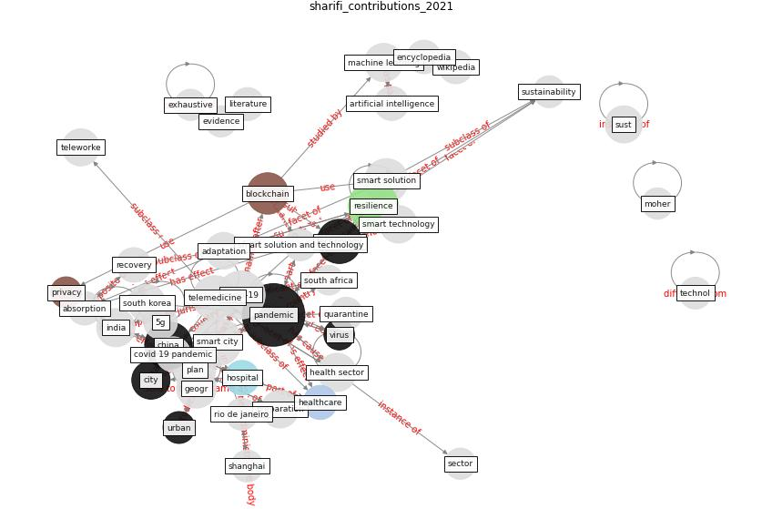

# Article: __Contributions of Smart City Solutions and Technologies to Resilience against the COVID-19 Pandemic: A Literature Review__ (sharifi_contributions_2021)

* [10.3390/su13148018](https://doi.org/10.3390/su13148018)
* Cluster: [smart-datum](cluster_8)

## Keywords

* [pandemic](keyword_pandemic), [resilience](keyword_resilience), [covid-19](keyword_covid-19), [smart city](keyword_smart_city), [china](keyword_china), [technology](keyword_technology), [telemedicine](keyword_telemedicine), [smart solution](keyword_smart_solution), [blockchain](keyword_blockchain), [plan](keyword_plan), [geogr](keyword_geogr), [machine learning](keyword_machine_learning), health sector, [city](keyword_city), smart technology

## Keywords at large

* [biophilic design](keyword_biophilic_design), [architecture](keyword_architecture), [sustainable architecture](keyword_sustainable_architecture), [nature](keyword_nature), [design](keyword_design), [biophilic](keyword_biophilic), [environ](keyword_environ), [biophilia](keyword_biophilia), [wellbeing](keyword_wellbeing), [health](keyword_health)

## Abstract

Since its emergence in late 2019, the COVID-19 pandemic
has swept through many cities around the world, claiming
millions of lives and causing major socio-economic impacts.
The pandemic occurred at an important historical juncture
when smart solutions and technologies have become
ubiquitous in many cities. Against this background, in this
review, we examine how smart city solutions and
technologies have contributed to resilience by enhancing
planning, absorption, recovery, and adaptation abilities.
For this purpose, we reviewed 147 studies that have
discussed issues related to the use of smart solutions and
technologies during the pandemic. The results were
synthesized under four themes, namely, planning and
preparation, absorption, recovery, and adaptation. This
review shows that investment in smart city initiatives can
enhance the planning and preparation ability. In addition,
the adoption of smart solutions and technologies can, among
other things, enhance the capacity of cities to predict
pandemic patterns, facilitate an integrated and timely
response, minimize or postpone transmission of the virus,
provide support to overstretched sectors, minimize supply
chain disruption, ensure continuity of basic services, and
offer solutions for optimizing city operations. These are
promising results that demonstrate the utility of smart
solutions for enhancing resilience. However, it should be
noted that realizing this potential hinges on careful
attention to important issues and challenges related to
privacy and security, access to open-source data,
technological affordance, legal barriers, technological
feasibility, and citizen engagement. Despite this, this
review shows that further development of smart city
initiatives can provide unprecedented opportunities for
enhancing resilience to the pandemic and similar future
events.

## Concepts

 

### References 

* [A Comprehensive Review of the COVID-19 Pandemic
and the Role of IoT, Drones, AI, Blockchain, and
5G in Managing its Impact](article_chamola_comprehensive_2020)
* [Exploring the Potential of Artificial Intelligence
and Machine Learning to Combat COVID-19 and
Existing Opportunities for LMIC: A Scoping
Review](article_naseem_exploring_2020)
* [A review of definitions and measures of system
resilience](article_hosseini_review_2016)
* [The three modes of existence of the pandemic smart city](article_soderstrom_three_2021)
* [The COVID-19 pandemic: Impacts on cities and major
lessons for urban planning, design, and management](article_sharifi_covid-19_2020)
* [The role of 5G for digital healthcare against COVID-19
pandemic: Opportunities and challenges](article_siriwardhana_role_2021)
* [Future (post-COVID) digital, smart and sustainable
cities in the wake of 6G: Digital twins, immersive
realities and new urban economies](article_allam_future_2021)
* [From Viral City to Smart City: Learning from
Pandemic Experiences](article_sakellarides_viral_2020)
* [Smart cities and a data-driven response to COVID-19](article_james_smart_2020)
* [DeepSOCIAL: Social Distancing Monitoring and
Infection Risk Assessment in COVID-19 Pandemic](article_rezaei_deepsocial_2020)
* [The effect of human mobility and control measures on the
COVID-19 epidemic in China](article_kraemer_effect_2020)
* [The Smart City and Covid‐19](article_webb_smart_2020)

### Cited by 

