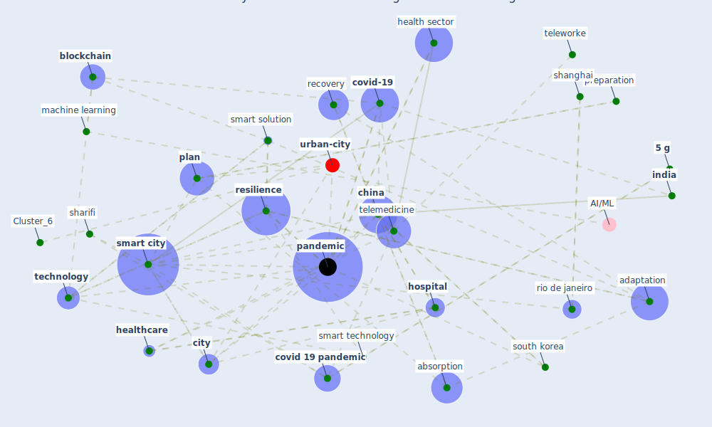

# Article: Contributions of Smart City Solutions and Technologies to Resilience against the COVID-19 Pandemic: A Literature Review (sharifi_contributions_2021)

* Source: [10.3390/su13148018](https://doi.org/10.3390/su13148018)
* Year: 2021
* Cluster: [iot-blockchain](cluster_7)

## Keywords

 * [5 g](keyword_5_g), absorption, [adaptation](keyword_adaptation), agarwal, [artificial intelligence](keyword_artificial_intelligence), [australia](keyword_australia), automation, azhar, [blockchain](keyword_blockchain), [bluetooth](keyword_bluetooth), boarding card, cern, [china](keyword_china), [city](keyword_city), communication, [covid 19 pandemic](keyword_covid_19_pandemic), [covid-19](keyword_covid-19), [crisis](keyword_crisis), [datum](keyword_datum), [detection](keyword_detection), [diagnosis](keyword_diagnosis), digitalization, early detection, elia, emergency plan, [evidence](keyword_evidence), exhaustive, forecast, forecasting, [france](keyword_france), hantrais, health sector, [healthcare](keyword_healthcare), [hospital](keyword_hospital), [india](keyword_india), [information](keyword_information), information technology, interpretive coding, [iot](keyword_iot), jaiswal, johannesburg, klein, [korea](keyword_korea), lee j, literature, ljubljana, [machine learning](keyword_machine_learning), [management](keyword_management), moher, nazir, pac, [pandemic](keyword_pandemic), pandemic control, park w, [perspective](keyword_perspective), [plan](keyword_plan), planner, [poland](keyword_poland), [prediction](keyword_prediction), preparation, [privacy](keyword_privacy), [public health](keyword_public_health), [quarantine](keyword_quarantine), [recovery](keyword_recovery), [research](keyword_research), [resilience](keyword_resilience), rio de janeiro, scopus, [sector](keyword_sector), [sensor](keyword_sensor), [shanghai](keyword_shanghai), sharifi, [smart](keyword_smart), [smart city](keyword_smart_city), smart solution, smart solution and technology, smart technology, socio economic, [south africa](keyword_south_africa), [south korea](keyword_south_korea), stage, sui, [supply chain](keyword_supply_chain), sustain, [sustainability](keyword_sustainability), [switzerland](keyword_switzerland), [symptom](keyword_symptom), [technology](keyword_technology), [telemedicine](keyword_telemedicine), [teleworke](keyword_teleworke), [theme](keyword_theme), [tourism](keyword_tourism), [trace](keyword_trace), travel card, [unesco](keyword_unesco), [united kingdom](keyword_united_kingdom), university of pennsylvania, [urban planning](keyword_urban_planning), [virus](keyword_virus), [world health organization](keyword_world_health_organization)

## Concepts

 

## Neighbours

### Closest articles

* Learning from the COVID-19 pandemic in governing smart cities - [LINK](article_bolivar_learning_2022)
* Future (post-COVID) digital, smart and sustainable cities in the wake of 6G: Digital twins, immersive realities and new urban economies - [LINK](article_allam_future_2021)
* The three modes of existence of the pandemic smart city - [LINK](article_soderstrom_three_2021)
* Smart cities and the pandemic: digital technologies on the urban management of Brazilian cities - [LINK](article_fariniuk_smart_2020)
* The Smart City and Covid‐19 - [LINK](article_webb_smart_2020)
* The Emergence of Anti-Privacy and Control at the Nexus between the Concepts of Safe City and Smart City - [LINK](article_allam_emergence_2019)
* Smart cities and a data-driven response to COVID-19 - [LINK](article_james_smart_2020)
* On the Coronavirus (COVID-19) Outbreak and the Smart City Network: Universal Data Sharing Standards Coupled with Artificial Intelligence (AI) to Benefit Urban Health Monitoring and Management - [LINK](article_allam_coronavirus_2020)
* Pandemic stricken cities on lockdown. Where are our planning and design professionals [now, then and into the future]? - [LINK](article_allam_pandemic_2020)
* Proximity and post-COVID-19 urban development: Reflections from Milan, Italy - [LINK](article_tricarico_proximity_2021)

### Closest BPs

* Blueprint: Monitoring of wastewater - [LINK](bp_21)
* Blueprint: Resilience in staffing and skills training - [LINK](bp_12)
* Blueprint: Air Cleaning Plants - [LINK](bp_15)
