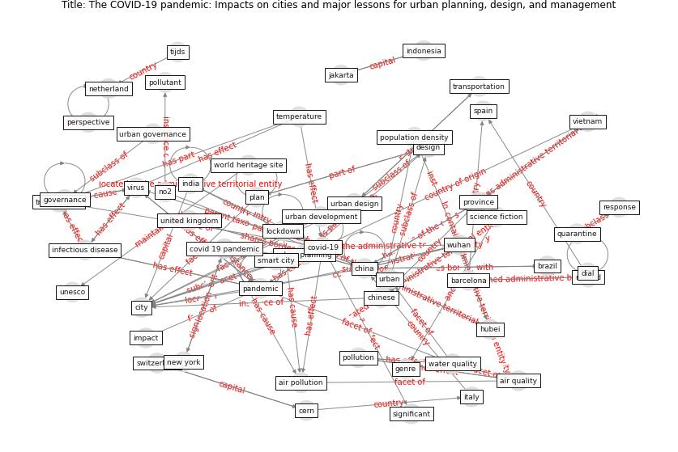

# Article: __The COVID-19 pandemic: Impacts on cities and major lessons for urban planning, design, and management__ (sharifi_covid-19_2020)

* [10.1016/j.scitotenv.2020.142391](https://doi.org/10.1016/j.scitotenv.2020.142391)
* Cluster: [city-smart](cluster_10)

## Keywords

* [pandemic](keyword_pandemic), [covid-19](keyword_covid-19), [china](keyword_china), [city](keyword_city), [wuhan](keyword_wuhan), [genre](keyword_genre), science fiction, [urban design](keyword_urban_design), [air quality](keyword_air_quality), [india](keyword_india), [covid 19 pandemic](keyword_covid_19_pandemic), [italy](keyword_italy), [lockdown](keyword_lockdown), [virus](keyword_virus), [water quality](keyword_water_quality)

## Keywords at large

* [pandemic](keyword_pandemic), [covid-19](keyword_covid-19), [china](keyword_china), [city](keyword_city), [wuhan](keyword_wuhan), [plan](keyword_plan), [transp](keyword_transp), [perspective](keyword_perspective), [dial](keyword_dial), [genre](keyword_genre)

## Abstract

Since the early days of the COVID-19 crisis the scientific
community has constantly been striving to shed light on
various issues such as the mechanisms driving the spread of
the virus, its environmental and socio-economic impacts,
and necessary recovery and adaptation plans and policies.
Given the high concentration of population and economic
activities in cities, they are often hotspots of COVID-19
infections. Accordingly, many researchers are struggling to
explore the dynamics of the pandemic in urban areas to
understand impacts of COVID-19 on cities. In this study we
seek to provide an overview of COVID-19 research related to
cities by reviewing literature published during the first
eight months after the first confirmed cases were reported
in Wuhan, China. The main aims are to understand impacts of
the pandemic on cities and to highlight major lessons that
can be learned for post-COVID urban planning and design.
Results show that, in terms of thematic focus, early
research on the impacts of COVID-19 on cities is mainly
related to four major themes, namely, (1) environmental
quality, (2) socio-economic impacts, (3) management and
governance, and (4) transportation and urban design. While
this indicates a diverse research agenda, the first theme
that covers issues related to air quality, meteorological
parameters, and water quality is dominant, and the others
are still relatively underexplored. Improvements in air and
water quality in cities during lockdown periods highlight
the significant environmental impacts of anthropogenic
activities and provide a wake-up call to adopt
environmentally friendly development pathways. The paper
also provides other recommendations related to the
socio-economic factors, urban management and governance,
and transportation and urban design that can be used for
post-COVID urban planning and design. Overall, existing
knowledge shows that the COVID-19 crisis entails an
excellent opportunity for planners and policy makers to
take transformative actions towards creating cities that
are more just, resilient, and sustainable.,

Unlabelled Image

## Concepts

 

### Closest articles 

* [Respiratory pandemics, urban planning and design: A multidisciplinary rapid review of the literature](article_harris_respiratory_2022)
* [COVID-19 Pandemic: Rethinking Strategies for
Resilient Urban Design, Perceptions, and
Planning](article_afrin_covid-19_2021)
* [Pandemic stricken cities on lockdown. Where are our planning and design professionals [now, then and into the future]?](article_allam_pandemic_2020)
* [Epidemics, Planning and the City: A Special Issue of Planning Perspectives](article_davis_epidemics_2022)
* [COVID-19: Lessons for an Urban(izing) World](article_acuto_covid-19_2020)
* [Coronavirus questions that will not go away: interrogating urban and socio-spatial implications of COVID-19 measures](article_salama_coronavirus_2020)
* [Learning from pandemics: Applying resilience thinking to identify priorities for planning urban settlements](article_syal_learning_2021)
* [On the Coronavirus (COVID-19) Outbreak and the Smart City Network: Universal Data Sharing Standards Coupled with Artificial Intelligence (AI) to Benefit Urban Health Monitoring and Management](article_allam_coronavirus_2020)
* [Antivirus-built environment: Lessons learned from Covid-19 pandemic](article_megahed_antivirus-built_2020)
* [WHO-2019-nCoV-Urban_preparedness-2020.1-eng](article_WHO-2019-nCoV-Urban_preparedness-2020.1-eng)

### References 

* [Smart cities and a data-driven response to COVID-19](article_james_smart_2020)
* [The effect of human mobility and control measures on the
COVID-19 epidemic in China](article_kraemer_effect_2020)
* [An investigation of transmission control measures during
the first 50 days of the COVID-19 epidemic in China](article_tian_investigation_2020)

### Cited by 

* [A Review on Building Design as a Biomedical
System for Preventing COVID-19 Pandemic](article_amran_review_2022)
* [Prophylactic Architecture: Formulating the Concept
of Pandemic-Resilient Homes](article_elrayies_prophylactic_2022)
* [Respiratory pandemics, urban planning and design: A
multidisciplinary rapid review of the literature](article_harris_respiratory_2022)
* [Healthy Sustainable Cities and the COVID-19
Pandemic: A Sustainable Development Goals
Perspective](article_muthu_healthy_2021)
* [The impact of the COVID-19 pandemic on the importance of
urban green spaces to the public](article_noszczyk_impact_2022)
* [Contributions of Smart City Solutions and
Technologies to Resilience against the COVID-19
Pandemic: A Literature Review](article_sharifi_contributions_2021)
