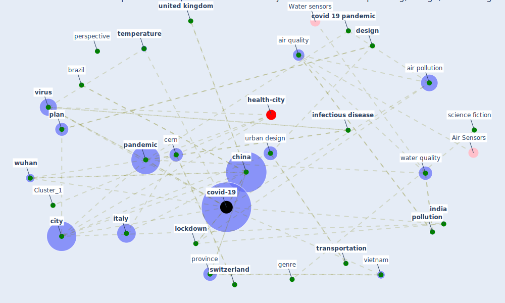

# Article: The COVID-19 pandemic: Impacts on cities and major lessons for urban planning, design, and management (sharifi_covid-19_2020)

* Source: [10.1016/j.scitotenv.2020.142391](https://doi.org/10.1016/j.scitotenv.2020.142391)
* Year: 2020
* Cluster: [urban-city](cluster_6)

## Keywords

 * [air](keyword_air), [air pollution](keyword_air_pollution), air quality, american city, asia, [barcelona](keyword_barcelona), bike sharing, bike sharing network, [brazil](keyword_brazil), cern, [china](keyword_china), [chinese](keyword_chinese), chinese city, [city](keyword_city), [country](keyword_country), covid 19 outbreak, [covid 19 pandemic](keyword_covid_19_pandemic), [covid-19](keyword_covid-19), [cycling](keyword_cycling), cyclist, czech republic, [design](keyword_design), dial, emergency plan, genre, governance, [hubei](keyword_hubei), hum, humboldt, humboldt university, [humidity](keyword_humidity), [impact](keyword_impact), [india](keyword_india), indian, [indonesia](keyword_indonesia), [infectious disease](keyword_infectious_disease), italian, [italy](keyword_italy), jakarta, [lockdown](keyword_lockdown), lviv, madrid, meteorological, [milan](keyword_milan), [mobility](keyword_mobility), music, [netherland](keyword_netherland), [new york](keyword_new_york), no2, o3, oslo, [pandemic](keyword_pandemic), [perspective](keyword_perspective), [plan](keyword_plan), planner, [poland](keyword_poland), [pollutant](keyword_pollutant), pollution, population density, [portugal](keyword_portugal), [province](keyword_province), quarantine, [recovery](keyword_recovery), region, response, rural, santander, science fiction, scopus, significant, [smart city](keyword_smart_city), socio economic, song, [spain](keyword_spain), [switzerland](keyword_switzerland), [temperature](keyword_temperature), the pandemic, [theme](keyword_theme), tijds, [transmission](keyword_transmission), transportation, [treatment](keyword_treatment), ukraine, [unesco](keyword_unesco), [united kingdom](keyword_united_kingdom), [urban](keyword_urban), urban design, urban development, [urban governance](keyword_urban_governance), [urban planning](keyword_urban_planning), urbanisation, vietnam, view, [virus](keyword_virus), [wastewater](keyword_wastewater), wastewater treatment, water quality, [well be](keyword_well_be), [world heritage site](keyword_world_heritage_site), [wuhan](keyword_wuhan)

## Concepts

 

## Neighbours

### Closest articles

* Respiratory pandemics, urban planning and design: A multidisciplinary rapid review of the literature - [LINK](article_harris_respiratory_2022)
* COVID-19 Pandemic: Rethinking Strategies for Resilient Urban Design, Perceptions, and Planning - [LINK](article_afrin_covid-19_2021)
* Pandemic stricken cities on lockdown. Where are our planning and design professionals [now, then and into the future]? - [LINK](article_allam_pandemic_2020)
* Epidemics, Planning and the City: A Special Issue of Planning Perspectives - [LINK](article_davis_epidemics_2022)
* COVID-19: Lessons for an Urban(izing) World - [LINK](article_acuto_covid-19_2020)
* Coronavirus questions that will not go away: interrogating urban and socio-spatial implications of COVID-19 measures - [LINK](article_salama_coronavirus_2020)
* On the Coronavirus (COVID-19) Outbreak and the Smart City Network: Universal Data Sharing Standards Coupled with Artificial Intelligence (AI) to Benefit Urban Health Monitoring and Management - [LINK](article_allam_coronavirus_2020)
* Learning from pandemics: Applying resilience thinking to identify priorities for planning urban settlements - [LINK](article_syal_learning_2021)
* Future (post-COVID) digital, smart and sustainable cities in the wake of 6G: Digital twins, immersive realities and new urban economies - [LINK](article_allam_future_2021)
* The Role of Architecture and Urbanism in Preventing Pandemics - [LINK](article_kumar_role_2021)

### Closest BPs

* Blueprint: Smart Locker System - [LINK](bp_1)
* Blueprint: Mental health – Act: Do something - [LINK](bp_18)
* Blueprint: Mental health – Belong: Do something with someone - [LINK](bp_19)
