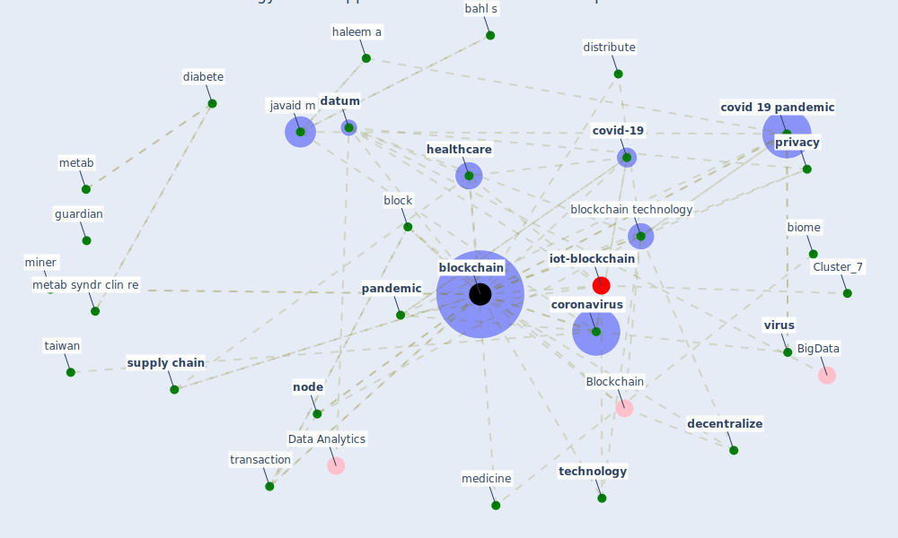

# Article: Blockchain technology and its applications to combat COVID-19 pandemic (sharma_blockchain_2022)

* Source: [10.1007/s42600-020-00106-3](https://doi.org/10.1007/s42600-020-00106-3)
* Year: 2022
* Cluster: [datum-iot](cluster_4)

## Keywords

 * 3d, bahl s, [big datum](keyword_big_datum), biome, block, [blockchain](keyword_blockchain), [blockchain technology](keyword_blockchain_technology), carin l, chain, [china](keyword_china), christodoulou k, christodoulou p, clin exp hepatol, [coronavirus](keyword_coronavirus), [coronavirus outbreak](keyword_coronavirus_outbreak), covid 19 coronavirus pandemic, covid 19 disease, [covid 19 pandemic](keyword_covid_19_pandemic), [covid-19](keyword_covid-19), [datum](keyword_datum), datum security, [datum sharing](keyword_datum_sharing), decentralization, decentralize, decentralize solution, decentralize storage, [diabete](keyword_diabete), discharge summary, distribute, distribute ledger technology, dzau v, economic outlook, electronic device, face mask, food, glove, good supply chain, [government](keyword_government), gown, guardian, haleem a, hardware, health worker, [healthcare](keyword_healthcare), healthcare protection, healthcare provider, hepatol, icomis, iee access, [india](keyword_india), inf manag, infectious incubation period, inform re, [innovation](keyword_innovation), institution drive interoperability, instrument, javaid m, jmir, medicine, metab, metab syndr clin re, miner, mining, nasdaq, [network](keyword_network), node, [oecd](keyword_oecd), online education, operation endure freedom, [outbreak](keyword_outbreak), [pandemic](keyword_pandemic), patient center interoperability, patient record, platform, practice, pre symptom, [privacy](keyword_privacy), protection gear, quarantine, recovery phase, [robot](keyword_robot), secure, [smart contract](keyword_smart_contract), [spread](keyword_spread), [supply chain](keyword_supply_chain), [symptom](keyword_symptom), [taiwan](keyword_taiwan), [technology](keyword_technology), this pandemic, track, trade, trading supply chain, transaction, transparency, [treatment](keyword_treatment), uav, [vaccine](keyword_vaccine), vaishya r, [virus](keyword_virus), worldwide health crisis

## Concepts

 

## Neighbours

### Closest articles

* How Can Blockchain Help People in the Event of Pandemics Such as the COVID-19? - [LINK](article_chang_how_2020)
* Health Information Exchange with Blockchain amid Covid-19-like Pandemics - [LINK](article_christodoulou_health_2020)
* Leveraging Digital Transformation Technologies to Tackle COVID-19: Proposing a Privacy-First Holistic Framework - [LINK](article_arpaci_leveraging_2021)
* Emerging Technologies to Combat the COVID-19 Pandemic - [LINK](article_vaishya_emerging_2020)
* A Comprehensive Review of the COVID-19 Pandemic and the Role of IoT, Drones, AI, Blockchain, and 5G in Managing its Impact - [LINK](article_chamola_comprehensive_2020)
* Internet of things (IoT) applications to fight against COVID-19 pandemic - [LINK](article_singh_internet_2020)
* The role of 5G for digital healthcare against COVID-19 pandemic: Opportunities and challenges - [LINK](article_siriwardhana_role_2021)
* Digital technology and COVID-19 - [LINK](article_ting_digital_2020)
* Mobile Technology Solution for COVID-19: Surveillance and Prevention - [LINK](article_raza_mobile_2021)
* Design COVID-19 Ontology: A Healthcare and Safety Perspective - [LINK](article_aloulou_design_2022)

### Closest BPs

* Blueprint: Air Cleaning Plants - [LINK](bp_15)
* Blueprint: Resilience in staffing and skills training - [LINK](bp_12)
* Blueprint: Rotational Shift System - [LINK](bp_0)
