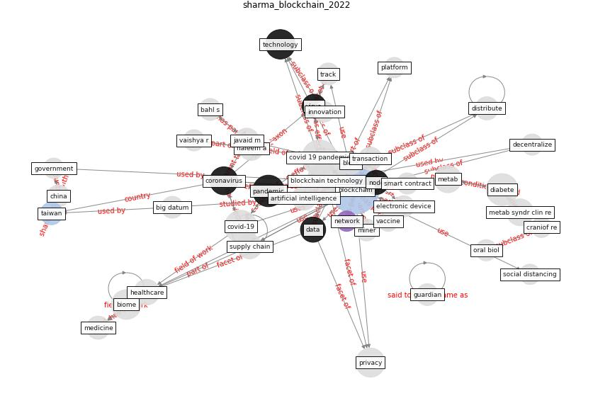

# Article: __Blockchain technology and its applications to combat COVID-19 pandemic__ (sharma_blockchain_2022)

* [10.1007/s42600-020-00106-3](https://doi.org/10.1007/s42600-020-00106-3)
* Cluster: [smart-datum](cluster_8)

## Keywords

[blockchain](keyword_blockchain), [pandemic](keyword_pandemic), [technology](keyword_technology), [privacy](keyword_privacy), [coronavirus](keyword_coronavirus), [healthcare](keyword_healthcare), [data](keyword_data)

## Concepts

 

### References 

* [How Can Blockchain Help People in the Event of
Pandemics Such as the COVID-19?](article_chang_how_2020)
* [Health Information Exchange with Blockchain amid
Covid-19-like Pandemics](article_christodoulou_health_2020)
* [Internet of things (IoT) applications to fight against
COVID-19 pandemic](article_singh_internet_2020)
* [Significant applications of virtual reality for COVID-19
pandemic](article_singh_significant_2020)
* [Sustainability of Coronavirus on Different
Surfaces](article_suman_sustainability_2020)
* [Digital technology and COVID-19](article_ting_digital_2020)
* [Emerging Technologies to Combat the COVID-19
Pandemic](article_vaishya_emerging_2020)

### Cited by 

