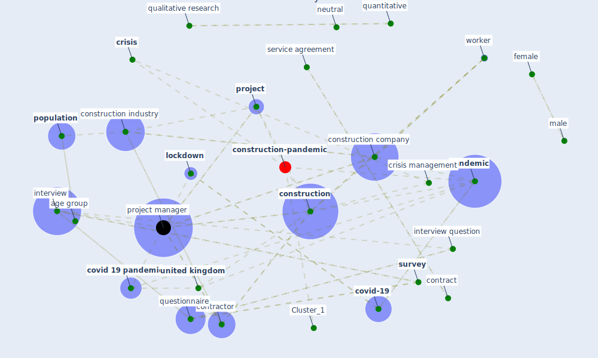

# Article: The Effects of Pandemic on Construction Industry in the UK (shibani_effects_2020)

* Source: [10.36941/mjss-2020-0063](https://doi.org/10.36941/mjss-2020-0063)
* Year: 2020
* Cluster: [construction-project](cluster_8)

## Keywords

 * 45 year, age distribution, [age group](keyword_age_group), [agree](keyword_agree), agree strongly agree, [business](keyword_business), [clean](keyword_clean), [construction](keyword_construction), construction company, [construction industry](keyword_construction_industry), construction labour force, construction manager, construction site, construction team, [contract](keyword_contract), [contractor](keyword_contractor), [control](keyword_control), convenience sampling, [covid 19 pandemic](keyword_covid_19_pandemic), [covid-19](keyword_covid-19), [crisis](keyword_crisis), crisis management, [datum](keyword_datum), datum analysis, diploma, [disinfect](keyword_disinfect), [economic](keyword_economic), edmund, [education](keyword_education), elevator, [facility](keyword_facility), female, gupta, głodziński, human capital, [industry](keyword_industry), interest, interview, interview question, keogh brown, konnur, level of education, likert scale, [lockdown](keyword_lockdown), london borough of camden, male, management science, [manager](keyword_manager), marciniak, mean, mhetre, neutral, office productivity, overhead cost, [pandemic](keyword_pandemic), [participant](keyword_participant), [person](keyword_person), pheng, philadelphia, [population](keyword_population), population and sample technique, production planning, [project](keyword_project), [project management](keyword_project_management), project manager, protective equipment, purposive sample, [qualitative](keyword_qualitative), qualitative research, quantitative, quantitative research, questionnaire, recommend sample size, [research](keyword_research), research design, research method, research question, research variable, [researcher](keyword_researcher), [sample](keyword_sample), sample size, sample technique, service agreement, site engineer, socioeconomic, standard deviation, sub group, subcontractor, [supply chain](keyword_supply_chain), supriadi, [survey](keyword_survey), [united kingdom](keyword_united_kingdom), university of oxford, university of pennsylvania, valid, valid disagree, work experience, [worker](keyword_worker), worksite, yang

## Concepts

 

## Neighbours

### Closest articles

* Mechanisms for addressing the impact of COVID-19 on infrastructure projects - [LINK](article_king_mechanisms_2021)
* The Impact of Pandemic Crisis on the Survival of Construction Industry: A Case of COVID-19 - [LINK](article_gamil_impact_2020)
* Perception of COVID-19 impacts on the construction industry over time - [LINK](article_rokooei_perception_2022)
* Covid-19 Associated Risks and Mitigation Strategies relevant for the UK Construction Industry - [LINK](article_dan-jumbo_covid-19_2021)
* Overcoming the Impact of COVID-19 Using Integrated Project Delivery Model - [LINK](article_g_overcoming_2020)
* Effects to Construction Project Management Impacted Circular Economic of Covid-19 Pandemic - [LINK](article_paikan_effects_2021)
* Influence between COVID-19 Impacts and Project Stakeholders in Chilean Construction Projects - [LINK](article_araya_influence_2021)
* COVID-19 pandemic: the effects and prospects in the construction industry. - [LINK](article_ogunnusi_covid-19_2020)
* Analysis of COVID-19 Concerns Raised by the Construction Workforce and Development of Mitigation Practices - [LINK](article_bou_hatoum_analysis_2021)
* Identifying Actions to Control and Mitigate the Effects of the COVID-19 Pandemic on Construction Organizations: Preliminary Findings - [LINK](article_raoufi_identifying_2021)

### Closest BPs

* Blueprint: Resilience in staffing and skills training - [LINK](bp_12)
* Blueprint: Installing UV in ductwork - [LINK](bp_10)
* Blueprint: Monitoring of wastewater - [LINK](bp_21)
