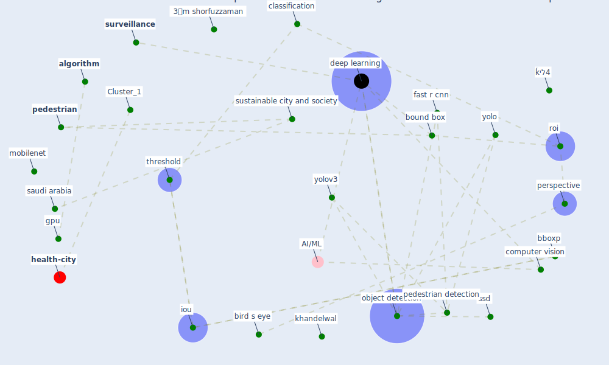

# Article: Towards the sustainable development of smart cities through mass video surveillance: A response to the COVID-19 pandemic (shorfuzzaman_towards_2021)

* Source: [10.1016/j.scs.2020.102582](https://doi.org/10.1016/j.scs.2020.102582)
* Year: 2021
* Cluster: [health-city](cluster_1)

## Keywords

 * 2𒀽m shorfuzzaman, 3𒀽m shorfuzzaman, 4 b, 5ߎ m shorfuzzaman, 9 میm shorfuzzaman, acm, [algorithm](keyword_algorithm), amodei, amsterdam, ananthanarayanan s, ap, [architecture](keyword_architecture), bboxp, benfold b, bird s eye, bird s eye view, [bound box](keyword_bound_box), [china](keyword_china), classification, commun, [computer vision](keyword_computer_vision), corner, [covid 19 pandemic](keyword_covid_19_pandemic), [covid-19](keyword_covid-19), cpus, current pandemic, [dataset](keyword_dataset), [deep learning](keyword_deep_learning), [detection](keyword_detection), detection and track, donahue j, [drone](keyword_drone), edge computing, european conference on computer vision, evaluation, fan, farhadi a, [fast r cnn](keyword_fast_r_cnn), [final](keyword_final), frame, girshick r, gpu, han k, [health care](keyword_health_care), [infection](keyword_infection), intersection over union, [iot](keyword_iot), [iou](keyword_iou), iou threshold, khan m, khandelwal, king saud university, lack of immunity, liang, [lockdown](keyword_lockdown), m shorfuzzaman, manocha, mobilenet, [monitor](keyword_monitor), [netherland](keyword_netherland), non intrusive, [object detection](keyword_object_detection), object detection model, object detector, ongoing pandemic, [outbreak](keyword_outbreak), [pandemic](keyword_pandemic), pandian k, [pedestrian](keyword_pedestrian), pedestrian detection, [perspective](keyword_perspective), post processing, precision, [prediction](keyword_prediction), pro cess, pytorch, recall, rectangle, redmon j, reid I, [robot](keyword_robot), roi, [saudi arabia](keyword_saudi_arabia), [smart city](keyword_smart_city), speech recognition, ssd, [surveillance](keyword_surveillance), sustainable city and society, [symptom](keyword_symptom), threshold, top down, [training](keyword_training), university of pennsylvania, [usa](keyword_usa), [video](keyword_video), visual, [yolo](keyword_yolo), yolov3, ہیm shorfuzzaman, ḱיל4

## Concepts

 

## Neighbours

### Closest articles

* DeepSOCIAL: Social Distancing Monitoring and Infection Risk Assessment in COVID-19 Pandemic - [LINK](article_rezaei_deepsocial_2020)
* An Automated System to Limit COVID-19 Using Facial Mask Detection in Smart City Network - [LINK](article_rahman_automated_2020)
*  - [LINK](article_huy-tran_design_2022)
* Internet of things (IoT) applications to fight against COVID-19 pandemic - [LINK](article_singh_internet_2020)
* Impact of COVID-19 on IoT Adoption in Healthcare, Smart Homes, Smart Buildings, Smart Cities, Transportation and Industrial IoT - [LINK](article_umair_impact_2021)
* COVID-19 Forced Hospitals to Build Negative Pressure Rooms Fast - [LINK](article_dyer_covid-19_2020)
* Rapid expansion of temporary, reliable airborne-infection isolation rooms with negative air machines for critical COVID-19 patients - [LINK](article_lee_rapid_2020)
* How the 5G Enabled the COVID-19 Pandemic Prevention and Control: Materiality, Affordance, and (De-)Spatialization - [LINK](article_li_how_2022)

### Closest BPs

* Blueprint: Negative pressure rooms - [LINK](bp_13)
* Blueprint: Installing UV in ductwork - [LINK](bp_10)
* Blueprint: Resilience in staffing and skills training - [LINK](bp_12)
