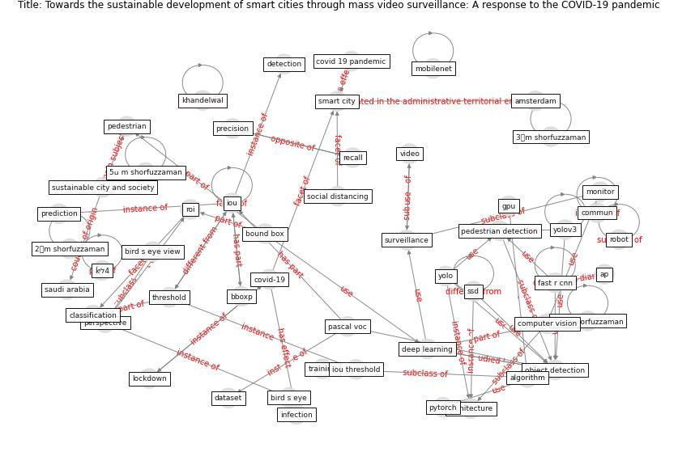

# Article: Towards the sustainable development of smart cities through mass video surveillance: A response to the COVID-19 pandemic (shorfuzzaman_towards_2021)

* Source: [10.1016/j.scs.2020.102582](https://doi.org/10.1016/j.scs.2020.102582)
* Year: 2021
* Cluster: [building-space](cluster_9)

## Keywords

 * 2𒀽m shorfuzzaman, 3𒀽m shorfuzzaman, 5ߎ m shorfuzzaman, 9 میm shorfuzzaman, acm, [algorithm](keyword_algorithm), amodei, amsterdam, ap, [architecture](keyword_architecture), bboxp, bird s eye, bird s eye view, [bound box](keyword_bound_box), [china](keyword_china), classification, commun, [computer vision](keyword_computer_vision), corner, [covid 19 pandemic](keyword_covid_19_pandemic), [covid-19](keyword_covid-19), cpus, [dataset](keyword_dataset), [deep learning](keyword_deep_learning), [detection](keyword_detection), detection and track, donahue j, [drone](keyword_drone), edge computing, european conference on computer vision, evaluation, fan, farhadi a, [fast r cnn](keyword_fast_r_cnn), frame, gpu, [health care](keyword_health_care), [infection](keyword_infection), intersection over union, [iot](keyword_iot), [iou](keyword_iou), iou threshold, khan m, khandelwal, king saud university, kolhar m, [lockdown](keyword_lockdown), m shorfuzzaman, manocha, metric, mobilenet, [monitor](keyword_monitor), [netherland](keyword_netherland), [object detection](keyword_object_detection), object detection model, object detector, ongoing pandemic, [outbreak](keyword_outbreak), [pandemic](keyword_pandemic), pandian k, pascal, pascal voc, pattern recognition, pedestrian, pedestrian detection, [perspective](keyword_perspective), post processing, precision, prediction, [privacy](keyword_privacy), pro cess, pytorch, real world coordinate, recall, rectangle, redmon j, reid I, [robot](keyword_robot), roi, [saudi arabia](keyword_saudi_arabia), [smart city](keyword_smart_city), [social distancing](keyword_social_distancing), social distancing violation, speech recognition, ssd, sun c, [surveillance](keyword_surveillance), sustainable city and society, [symptom](keyword_symptom), threshold, top down, training, usa, video, visual, who, [yolo](keyword_yolo), yolov3, ہیm shorfuzzaman, ḱיל4

## Concepts

 

## Neighbours

### Closest articles

* DeepSOCIAL: Social Distancing Monitoring and Infection Risk Assessment in COVID-19 Pandemic - [LINK](article_rezaei_deepsocial_2020)
*  - [LINK](article_huy-tran_design_2022)
* COVID-ABS: An agent-based model of COVID-19 epidemic to simulate health and economic effects of social distancing interventions - [LINK](article_silva_covid-abs_2020)
* EXPOSED: An occupant exposure model for confined spaces to retrofit crowd models during a pandemic - [LINK](article_ronchi_exposed_2020)
* Building occupancy estimation with people flow modeling in AnyLogic - [LINK](article_li_building_2016)
* Digital Twin of COVID-19 Mass Vaccination Centers - [LINK](article_pilati_digital_2021)
* Drones. Disinfecting robots. Supercomputers. The coronavirus outbreak is a test for China's tech industry \textbar CNN Business - [LINK](article_wang_drones_2020)
* COVID19-Routes: A Safe Pedestrian Navigation Service - [LINK](article_cantarero_covid19-routes_2021)
* 10 tech trends getting us through the COVID-19 pandemic - [LINK](article_yan_10_2020)

### Closest BPs

* Blueprint: Public places as information points - [LINK](bp_8)
* Blueprint: Rotational Shift System - [LINK](bp_0)
* Blueprint: One-way mobility circulation - [LINK](bp_4)
