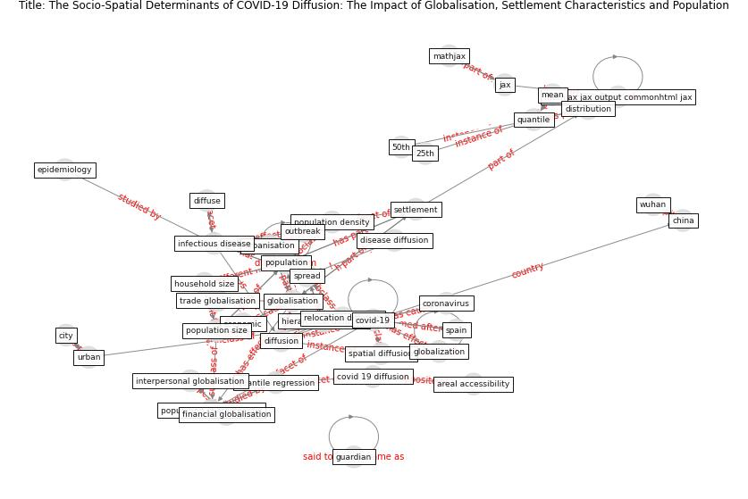

# Article: __The Socio-Spatial Determinants of COVID-19 Diffusion: The Impact of Globalisation, Settlement Characteristics and Population__ (sigler_socio-spatial_2020)

* [10.21203/rs.3.rs-33615/v1](https://doi.org/10.21203/rs.3.rs-33615/v1)
* Cluster: [city-spatial](cluster_3)

## Keywords

* [globalisation](keyword_globalisation), [covid-19](keyword_covid-19), [infectious disease](keyword_infectious_disease), [population](keyword_population), [quantile](keyword_quantile), [china](keyword_china), [jax](keyword_jax), [spread](keyword_spread), [mathjax](keyword_mathjax), [financial globalisation](keyword_financial_globalisation), [diffusion](keyword_diffusion), interpersonal globalisation, quantile regression, urbanisation, settlement

## Keywords at large

* [globalisation](keyword_globalisation), [covid-19](keyword_covid-19), [population](keyword_population), [infectious disease](keyword_infectious_disease), [china](keyword_china), [quantile](keyword_quantile), [jax](keyword_jax), [spread](keyword_spread), [mathjax](keyword_mathjax), [financial globalisation](keyword_financial_globalisation)

## Abstract

Abstract

Background: COVID-19 is an emergent infectious disease that
has spread geographically to become a global pandemic.
While much research focuses on the epidemiological and
virological aspects of the COVID-19 transmission, there
remains a gap in knowledge regarding the drivers of
geographical diffusion between places. Here, we use
quantile regression to model the roles of globalisation,
human settlement and population characteristics as
socio-spatial determinants of COVID-19 diffusion over a
six-week period in March and April 2020. Results: The
quantile regression model suggest that globalisation and
settlement population characteristics related to high human
mobility predict disease diffusion. Human development level
(HDI) and total population predict COVID-19 diffusion in
countries with a high number of total confirmed cases per
million whereas larger household size, older populations,
and globalisation tied to human interaction predict
COVID-19 diffusion in countries with a low number of total
confirmed cases per million. Conclusions: The analysis
confirms that globalisation, settlement and population
characteristics lead to greater disease diffusion, and
primarily variables tied to high human mobility. These
outcomes serve to inform policies around ‘flattening the
curve’, particularly as they related to anticipated
relocation diffusion from more- to less-developed countries
and regions, and hierarchical diffusion from countries with
higher population and density. Epidemiological strategies
must be tailored to suit the range of human mobility
patterns, as well as the variety of settlement and
population characteristics.

## Concepts

 

### Closest articles 

* [The socio-economic determinants of COVID-19: A spatial analysis of German county level data](article_ehlert_socio-economic_2021)
* [Climate and the spread of COVID-19](article_chen_climate_2021)
* [Association of built environment attributes with the spread of COVID-19 at its initial stage in China](article_li_association_2021)
* [Treating two pandemics for the price of one: Chronic and infectious disease impacts of the built and natural environment](article_frank_treating_2021)
* [Study of COVID-19 pandemic in London (UK) from urban context](article_ghosh_study_2020)
* [Infodemic and the spread of fake news in the COVID-19-era](article_orso_infodemic_2020)
* [The effect of human mobility and control measures on the COVID-19 epidemic in China](article_kraemer_effect_2020)
* [Open-source analytics tools for studying the COVID-19 coronavirus outbreak](article_wu_open-source_2020)
* 
* [How loneliness is talked about in social media during COVID-19 pandemic: Text mining of 4,492 Twitter feeds](article_koh_how_2022)

