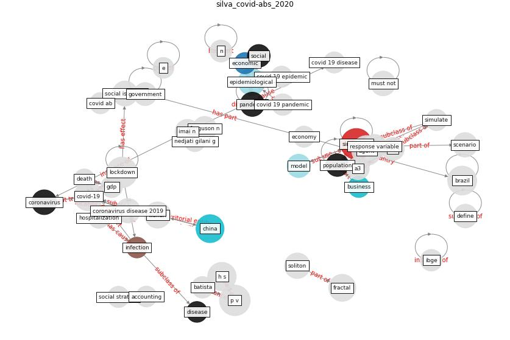

# Article: COVID-ABS: An agent-based model of COVID-19 epidemic to simulate health and economic effects of social distancing interventions (silva_covid-abs_2020)

* Source: [10.1016/j.chaos.2020.110088](https://doi.org/10.1016/j.chaos.2020.110088)
* Year: 2020
* Cluster: [city-health](cluster_14)

## Keywords

 * a1, a1 agent, a2, a3, a4, accounting, action, [agent](keyword_agent), agent base model, agent base simulation, [australia](keyword_australia), average, baseline, batista, [brazil](keyword_brazil), [business](keyword_business), chaos, [china](keyword_china), conceptualization, [contact](keyword_contact), contagion, [coronavirus](keyword_coronavirus), [country](keyword_country), covid 19 disease, covid 19 epidemic, [covid 19 pandemic](keyword_covid_19_pandemic), covid ab, [covid-19](keyword_covid-19), death, define, [disease](keyword_disease), do nothing, dynamic, [economic](keyword_economic), economic relationship, economical, [economy](keyword_economy), empirically, [epidemic](keyword_epidemic), [epidemiological](keyword_epidemiological), ferguson n, fractal, gdp, [government](keyword_government), grantz kh, h s, healthcare system, homeless, hospitalization, [house](keyword_house), ibge, imai n, income, income distribution, [infection](keyword_infection), infection curve, inform, intervention, isolation, [italy](keyword_italy), iteration, kai, [lockdown](keyword_lockdown), [london](keyword_london), [manhattan](keyword_manhattan), methodology, [model](keyword_model), must not, ndairou f, nedjati gilani g, [new south wale](keyword_new_south_wale), [new york city](keyword_new_york_city), p c, [p v](keyword_p_v), [pandemic](keyword_pandemic), partial isolation, partial isolation level, physical distancing, [population](keyword_population), population size, recession, response variable, [sar cov 2](keyword_sar_cov_2), scenario, scenario 2, seir model, simulate, [simulation](keyword_simulation), [social](keyword_social), social intervention, social isolation, social stratum, soliton, soliton and fractal, unemployed, walk freely, wealth, [work](keyword_work), [wuhan](keyword_wuhan), you have

## Concepts

 

## Neighbours

### Closest articles

* EXPOSED: An occupant exposure model for confined spaces to retrofit crowd models during a pandemic - [LINK](article_ronchi_exposed_2020)
* COVID19-Routes: A Safe Pedestrian Navigation Service - [LINK](article_cantarero_covid19-routes_2021)
* Building occupancy estimation with people flow modeling in AnyLogic - [LINK](article_li_building_2016)
* Digital Twin of COVID-19 Mass Vaccination Centers - [LINK](article_pilati_digital_2021)
* Risk Diagnosis and Mitigation System of COVID-19 Using Expert System and Web Scraping - [LINK](article_mufid_risk_2020)
* Exploring the Non-Medical impacts of Covid-19 using Natural Language Processing - [LINK](article_agade_exploring_2020)
* Infodemic and the spread of fake news in the COVID-19-era - [LINK](article_orso_infodemic_2020)
* Social distancing enhanced automated optimal design of physical spaces in the wake of the COVID-19 pandemic - [LINK](article_ugail_social_2021)
* Coronavirus: Can artificial intelligence be smart enough to detect fake news? - [LINK](article_tong_coronavirus_2020)
* Construction of a Linked Data Set of COVID-19 Knowledge Graphs: Development and Applications - [LINK](article_wang_construction_2022)

### Closest BPs

* Blueprint: Resilience in staffing and skills training - [LINK](bp_12)
* Blueprint: Negative pressure rooms - [LINK](bp_13)
* Blueprint: Public places as information points - [LINK](bp_8)
