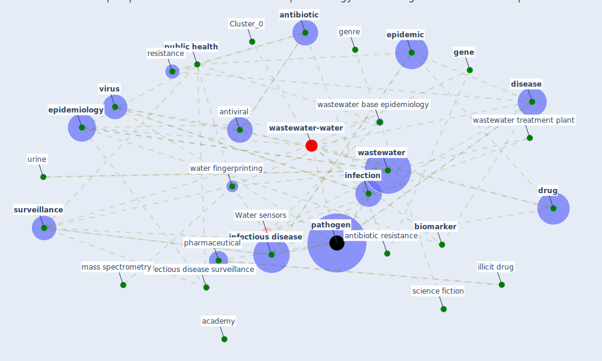

# Article: Future perspectives of wastewater-based epidemiology: Monitoring infectious disease spread and resistance to the community level (sims_future_2020)

* Source: [10.1016/j.envint.2020.105689](https://doi.org/10.1016/j.envint.2020.105689)
* Year: 2020
* Cluster: [air-sars](cluster_9)

## Keywords

 * [academy](keyword_academy), [antibiotic](keyword_antibiotic), antibiotic resistance, antibiotic resistance gene, antidepressant, [antimicrobial](keyword_antimicrobial), [antiviral](keyword_antiviral), [australia](keyword_australia), biological, [biomarker](keyword_biomarker), [canada](keyword_canada), carcinogen, castiglioni, chemical, [china](keyword_china), chromatic, chromatogr, compound, [coronavirus](keyword_coronavirus), [covid-19](keyword_covid-19), cryptosporidium, develop, [disease](keyword_disease), disease outbreak, [drug](keyword_drug), drug abuse, drug test, [economic](keyword_economic), effluent, emerg, emerg emerg, emerge infectious disease, [epidemic](keyword_epidemic), [epidemiological](keyword_epidemiological), epidemiologist, [epidemiology](keyword_epidemiology), ethic, [exposure](keyword_exposure), [gene](keyword_gene), [genome](keyword_genome), genre, [globalisation](keyword_globalisation), hazard, healing, [health](keyword_health), health perspect, illicit drug, infect, infect bmc, [infection](keyword_infection), [infectious disease](keyword_infectious_disease), infectious disease surveillance, interleukin, [japan](keyword_japan), kasprzyk hordern, mass spectrometry, medicine, metabolite, [microbiol](keyword_microbiol), [monitor](keyword_monitor), [outbreak](keyword_outbreak), [pathogen](keyword_pathogen), pathogenic, pharmaceutical, [population](keyword_population), population size, protein, [public health](keyword_public_health), public health surveillance, rep, resistance, resistance gene, respiratory infection, science, science fiction, [sewage](keyword_sewage), [sewer](keyword_sewer), [social](keyword_social), [spread](keyword_spread), surface water, [surveillance](keyword_surveillance), [symptom](keyword_symptom), tamiflu, tandem mass spectrometry, technol sci, temporal, test, tobacco, [tuberculosis](keyword_tuberculosis), urinary, urine, [viral](keyword_viral), [virus](keyword_virus), [wastewater](keyword_wastewater), wastewater analysis, wastewater base epidemiology, wastewater treatment, wastewater treatment plant, [water](keyword_water), water fingerprinting

## Concepts

 

## Neighbours

### Closest articles

* Computational analysis of SARS-CoV-2/COVID-19 surveillance by wastewater-based epidemiology locally and globally: Feasibility, economy, opportunities and challenges - [LINK](article_hart_computational_2020)
* When the fourth water and digital revolution encountered COVID-19 - [LINK](article_poch_when_2020)
* Wastewater-Based Epidemiology to monitor COVID-19 outbreak: Present and future diagnostic methods to be in your radar - [LINK](article_barcelo_wastewater-based_2020)
* Wastewater surveillance for population-wide Covid-19: The present and future - [LINK](article_daughton_wastewater_2020)
* An environmental and health perspective for COVID-19 outbreak: Meteorology and air quality influence, sewage epidemiology indicator, hospitals disinfection, drug therapies and recommendations - [LINK](article_barcelo_environmental_2020)
* SARS-CoV-2 in wastewater: potential health risk, but also data source - [LINK](article_lodder_sars-cov-2_2020)
* SARS-CoV-2 RNA in wastewater anticipated COVID-19 occurrence in a low prevalence area - [LINK](article_randazzo_sars-cov-2_2020)
* First detection of SARS-CoV-2 in untreated wastewaters in Italy - [LINK](article_la_rosa_first_2020)
* First confirmed detection of SARS-CoV-2 in untreated wastewater in Australia: A proof of concept for the wastewater surveillance of COVID-19 in the community - [LINK](article_ahmed_first_2020)
* Presence of SARS-Coronavirus-2 RNA in Sewage and Correlation with Reported COVID-19 Prevalence in the Early Stage of the Epidemic in The Netherlands - [LINK](article_medema_presence_2020)

### Closest BPs

* Blueprint: Monitoring of wastewater - [LINK](bp_21)
* Blueprint: Installing UV in ductwork - [LINK](bp_10)
* Blueprint: Smart Locker System - [LINK](bp_1)
