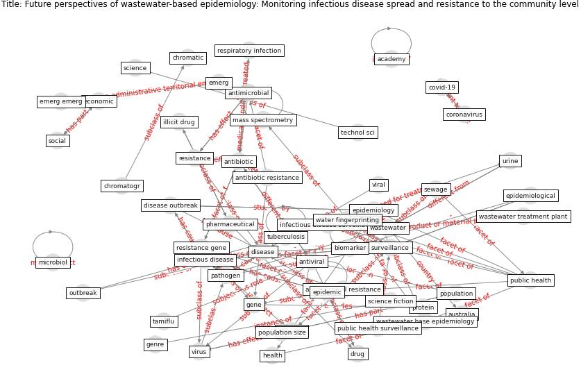

# Article: __Future perspectives of wastewater-based epidemiology: Monitoring infectious disease spread and resistance to the community level__ (sims_future_2020)

* [10.1016/j.envint.2020.105689](https://doi.org/10.1016/j.envint.2020.105689)
* Cluster: [wastewater-sars](cluster_12)

## Keywords

* [environ](keyword_environ), [wastewater](keyword_wastewater), [antibiotic](keyword_antibiotic), [infectious disease](keyword_infectious_disease), [biomarker](keyword_biomarker), [public health](keyword_public_health), [anal](keyword_anal), [pathogen](keyword_pathogen), [chemistry](keyword_chemistry), [chem](keyword_chem), [epidemiology](keyword_epidemiology), [total environ](keyword_total_environ), [virus](keyword_virus), [microbiol](keyword_microbiol), [surveillance](keyword_surveillance)

## Keywords at large

* [biophilic design](keyword_biophilic_design), [architecture](keyword_architecture), [sustainable architecture](keyword_sustainable_architecture), [nature](keyword_nature), [design](keyword_design), [biophilic](keyword_biophilic), [environ](keyword_environ), [biophilia](keyword_biophilia), [wellbeing](keyword_wellbeing), [health](keyword_health)

## Concepts

 

