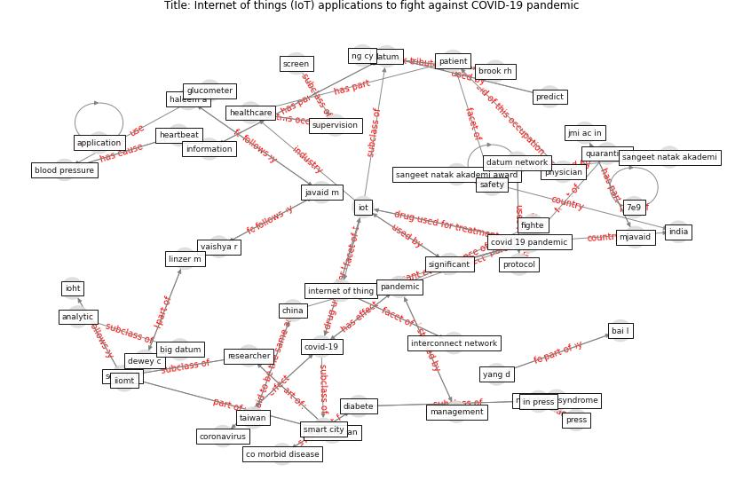

# Article: __Internet of things (IoT) applications to fight against COVID-19 pandemic__ (singh_internet_2020)

* [10.1016/j.dsx.2020.04.041](https://doi.org/10.1016/j.dsx.2020.04.041)
* Cluster: [smart-datum](cluster_8)

## Keywords

* [iot](keyword_iot), [covid 19 pandemic](keyword_covid_19_pandemic), [covid-19](keyword_covid-19), [diabete](keyword_diabete), [metabolic syndrome](keyword_metabolic_syndrome), [healthcare](keyword_healthcare), [in press](keyword_in_press), [press](keyword_press), [pandemic](keyword_pandemic), [data](keyword_data), [internet of thing](keyword_internet_of_thing), [significant](keyword_significant), javaid m, [china](keyword_china), academician

## Keywords at large

* [biophilic design](keyword_biophilic_design), [architecture](keyword_architecture), [sustainable architecture](keyword_sustainable_architecture), [nature](keyword_nature), [design](keyword_design), [biophilic](keyword_biophilic), [environ](keyword_environ), [biophilia](keyword_biophilia), [wellbeing](keyword_wellbeing), [health](keyword_health)

## Concepts

 

### References 

* [Response to COVID-19 in Taiwan: Big Data
Analytics, New Technology, and Proactive
Testing](article_wang_response_2020)

### Cited by 

* [COVID19-Routes: A Safe Pedestrian Navigation
Service](article_cantarero_covid19-routes_2021)
* [Digital Twin of COVID-19 Mass Vaccination
Centers](article_pilati_digital_2021)
* [Blockchain technology and its applications to combat
COVID-19 pandemic](article_sharma_blockchain_2022)
* [Impact of COVID-19 on IoT Adoption in Healthcare,
Smart Homes, Smart Buildings, Smart Cities,
Transportation and Industrial IoT](article_umair_impact_2021)
