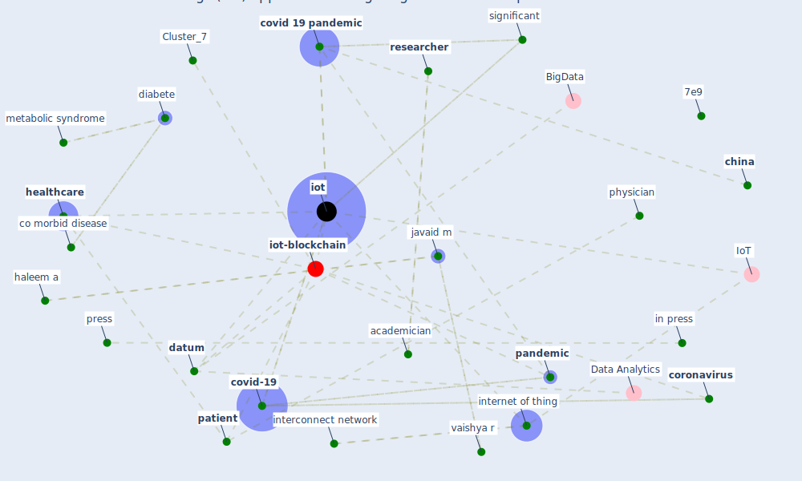

# Article: Internet of things (IoT) applications to fight against COVID-19 pandemic (singh_internet_2020)

* Source: [10.1016/j.dsx.2020.04.041](https://doi.org/10.1016/j.dsx.2020.04.041)
* Year: 2020
* Cluster: [datum-iot](cluster_4)

## Keywords

 * 12e15, 7e9, academic research, academician, [analytic](keyword_analytic), [application](keyword_application), bai l, [big datum](keyword_big_datum), blood pressure, brook rh, [china](keyword_china), cluster, co morbid disease, compete interest, connect network, [coronavirus](keyword_coronavirus), coronavirus covid 19, coronavirus covid 19 outbreak, [covid 19 pandemic](keyword_covid_19_pandemic), [covid-19](keyword_covid-19), [datum](keyword_datum), datum network, dewey c, [diabete](keyword_diabete), disord, doctor, glucometer, ground level, gupta r, haleem a, [healthcare](keyword_healthcare), heartbeat, [hospital](keyword_hospital), hypertension, identification, iiomt, in press, [india](keyword_india), [information](keyword_information), inn, [innovation](keyword_innovation), interconnect computing, interconnect network, [internet](keyword_internet), [internet of thing](keyword_internet_of_thing), ioht, [iot](keyword_iot), iot philosophy, javaid m, jmi ac in, linzer m, machine learning, [management](keyword_management), medicine, [metabolic syndrome](keyword_metabolic_syndrome), mjavaid, move outside, ng cy, non effective reachability, old people, orthopaedic, [pandemic](keyword_pandemic), pandemic 1, [patient](keyword_patient), physician, predict, predict the situation, present pandemic, press, [protocol](keyword_protocol), quarantine, report, [researcher](keyword_researcher), [safety](keyword_safety), sangeet natak akademi, sangeet natak akademi award, scientist, screen, significant, [smart city](keyword_smart_city), smart helmet, smart network, smart speaker, smartphone, [social](keyword_social), software, stoessl aj, supervision, symptom relate to the coronavirus, [taiwan](keyword_taiwan), tele device, [treatment](keyword_treatment), unique identification number, urban health monitoring and management, vaccine development, vaishya r, wang y, yang d, zheng sq, fighte

## Concepts

 

## Neighbours

### Closest articles

* Emerging Technologies to Combat the COVID-19 Pandemic - [LINK](article_vaishya_emerging_2020)
* The role of 5G for digital healthcare against COVID-19 pandemic: Opportunities and challenges - [LINK](article_siriwardhana_role_2021)
* Leveraging Digital Transformation Technologies to Tackle COVID-19: Proposing a Privacy-First Holistic Framework - [LINK](article_arpaci_leveraging_2021)
* Mobile Technology Solution for COVID-19: Surveillance and Prevention - [LINK](article_raza_mobile_2021)
* Significant applications of virtual reality for COVID-19 pandemic - [LINK](article_singh_significant_2020)
* A Comprehensive Review of the COVID-19 Pandemic and the Role of IoT, Drones, AI, Blockchain, and 5G in Managing its Impact - [LINK](article_chamola_comprehensive_2020)
* Health Information Exchange with Blockchain amid Covid-19-like Pandemics - [LINK](article_christodoulou_health_2020)
* Digital technology and COVID-19 - [LINK](article_ting_digital_2020)
* Blockchain technology and its applications to combat COVID-19 pandemic - [LINK](article_sharma_blockchain_2022)
* Using Technology to Maintain the Education of Residents During the COVID-19 Pandemic - [LINK](article_chick_using_2020)

### Closest BPs

* Blueprint: Resilience in staffing and skills training - [LINK](bp_12)
* Blueprint: Air Cleaning Plants - [LINK](bp_15)
* Blueprint: Public places as information points - [LINK](bp_8)
