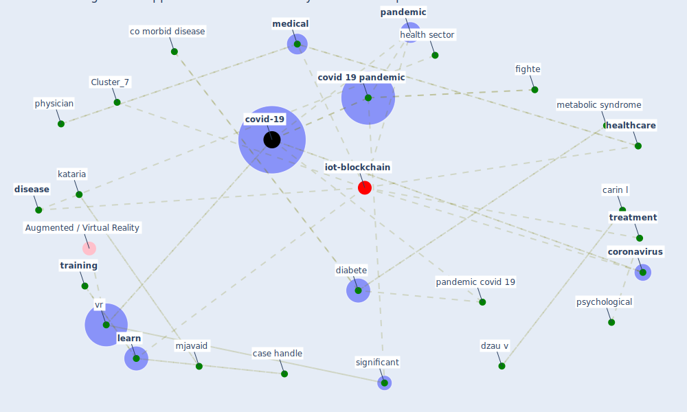

# Article: Significant applications of virtual reality for COVID-19 pandemic (singh_significant_2020)

* Source: [10.1016/j.dsx.2020.05.011](https://doi.org/10.1016/j.dsx.2020.05.011)
* Year: 2020
* Cluster: [iot-blockchain](cluster_7)

## Keywords

 * 11e15, 19e21, abid gmail com, academic research, amparore d, aop, autorino r, bender ja, beneficiarie, benefits, carin l, case handle, chowdhury I, co morbid disease, cohen gadol, cohen mj, communication, [computer](keyword_computer), computer base, conclusion, [coronavirus](keyword_coronavirus), correspond author, [covid 19 pandemic](keyword_covid_19_pandemic), [covid-19](keyword_covid-19), dasgupta p, [diabete](keyword_diabete), [digital](keyword_digital), [disease](keyword_disease), dzau v, [education](keyword_education), emergency medicine, [engineering](keyword_engineering), [epidemic](keyword_epidemic), gratification, hachach haram n, haleem a, headset, health sector, health worker, [healthcare](keyword_healthcare), healthcare domain, healthcare professional, healthcare relate, hemodynamic, hypertension, immersive, immunologist, [india](keyword_india), [infection](keyword_infection), interactive, jagel b, javaid m, kang uj, kataria, [learn](keyword_learn), madurai elavarasan, [medical](keyword_medical), [mental](keyword_mental), [metabolic syndrome](keyword_metabolic_syndrome), mjavaid, movement disorder, neurosurg, pain, [pandemic](keyword_pandemic), pandemic covid 19, parkinson s disease, patient education, patient satisfaction, physician, pmc7180041, pmcid, pmid, post covid 19 era, proficient, ps, [psychological](keyword_psychological), psychosomatic disturbance, rahman t, raje suman gmail com, ray k, recovery time, [researcher](keyword_researcher), rismanbaf, [safety](keyword_safety), sandar j, sangeet natak akademi, sangeet natak akademi award, schro covid 19 pandemic, significant, [simulation](keyword_simulation), start phase, [surgery](keyword_surgery), teachinglearne, technique, telecommunication, [training](keyword_training), [treatment](keyword_treatment), [vr](keyword_vr), vr headset, fighte

## Concepts

 

## Neighbours

### Closest articles

* Contributions to the mitigation of the COVID-19 pandemic - [LINK](article_pilz_contributions_2022)
* DfMA for rapid adaptive resilience and flexible infrastructure - [LINK](article_mott_macdonald_dfma_2020)
* Case Study on Finnish TVETA Resilient Model of Training During COVID-19 - [LINK](article_unesco_case_2021)
* 10 tech trends getting us through the COVID-19 pandemic - [LINK](article_yan_10_2020)
* Physical interventions to interrupt or reduce the spread of respiratory viruses: systematic review - [LINK](article_jefferson_physical_2008)
* SARS-CoV-2 in wastewater: potential health risk, but also data source - [LINK](article_lodder_sars-cov-2_2020)
* Wastewater surveillance for population-wide Covid-19: The present and future - [LINK](article_daughton_wastewater_2020)

### Closest BPs

* Blueprint: Resilience in staffing and skills training - [LINK](bp_12)
* Blueprint: Negative pressure rooms - [LINK](bp_13)
* Blueprint: Smart Locker System - [LINK](bp_1)
