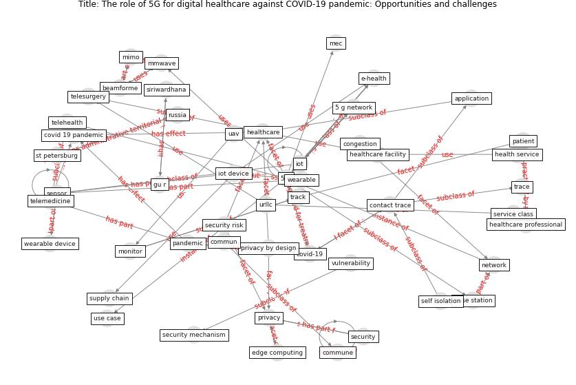

# Article: __The role of 5G for digital healthcare against COVID-19 pandemic: Opportunities and challenges__ (siriwardhana_role_2021)

* [10.1016/j.icte.2020.10.002](https://doi.org/10.1016/j.icte.2020.10.002)
* Cluster: [blockchain-technology](cluster_13)

## Keywords

[healthcare](keyword_healthcare), [network](keyword_network), [pandemic](keyword_pandemic), [blockchain](keyword_blockchain)

## Abstract

COVID-19 pandemic caused a massive impact on healthcare,
social life, and economies on a global scale. Apparently,
technology has a vital role to enable ubiquitous and
accessible digital health services in pandemic conditions
as well as against “re-emergence” of COVID-19 disease
in a post-pandemic era. Accordingly, 5G systems and
5G-enabled e-health solutions are paramount. This paper
highlights methodologies to effectively utilize 5G for
e-health use cases and its role to enable relevant digital
services. It also provides a comprehensive discussion of
the implementation issues, possible remedies and future
research directions for 5G to alleviate the health
challenges related to COVID-19.

## Concepts

 

### References 

* [How Can Blockchain Help People in the Event of
Pandemics Such as the COVID-19?](article_chang_how_2020)

### Cited by 

* [How the 5G Enabled the COVID-19 Pandemic
Prevention and Control: Materiality, Affordance,
and (De-)Spatialization](article_li_how_2022)* [Contributions of Smart City Solutions and
Technologies to Resilience against the COVID-19
Pandemic: A Literature Review](article_sharifi_contributions_2021)
