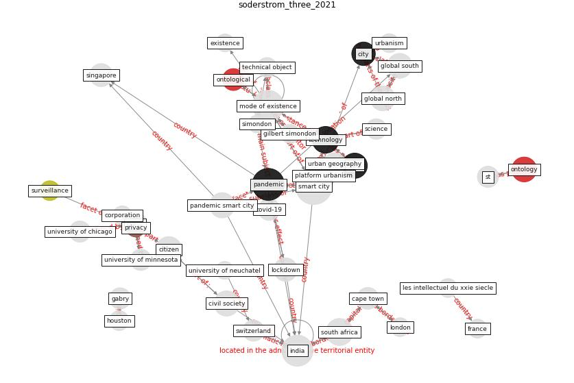

# Article: __The three modes of existence of the pandemic smart city__ (soderstrom_three_2021)

* [10.1080/02723638.2020.1807167](https://doi.org/10.1080/02723638.2020.1807167)
* Cluster: [health-city](cluster_3)

## Keywords

[pandemic](keyword_pandemic), [technology](keyword_technology), [data](keyword_data), [ontology](keyword_ontology)

## Abstract

Working on the provincialisation of the smart city in
South Africa and India, the members of our research team
recently witnessed, as the Covid-19 pandemic spread across
the five countries in which we live and work, the emergence
of a ‘pandemic smart city’. Technologies, institutions,
organisations and people we were observing and working with
were repurposed, reshaped or reoriented in efforts to
manage and mitigate the public health crisis. Drawing on
work on ontological pluralism and on postcolonial urban
studies, this introductory piece and the articles in this
special issue argue that the management of the pandemic in
cities of the Global South is closely intertwined with the
three modes of existence of the smart city: the state-led,
corporate-led and citizen-led smart city.

## Concepts

 

