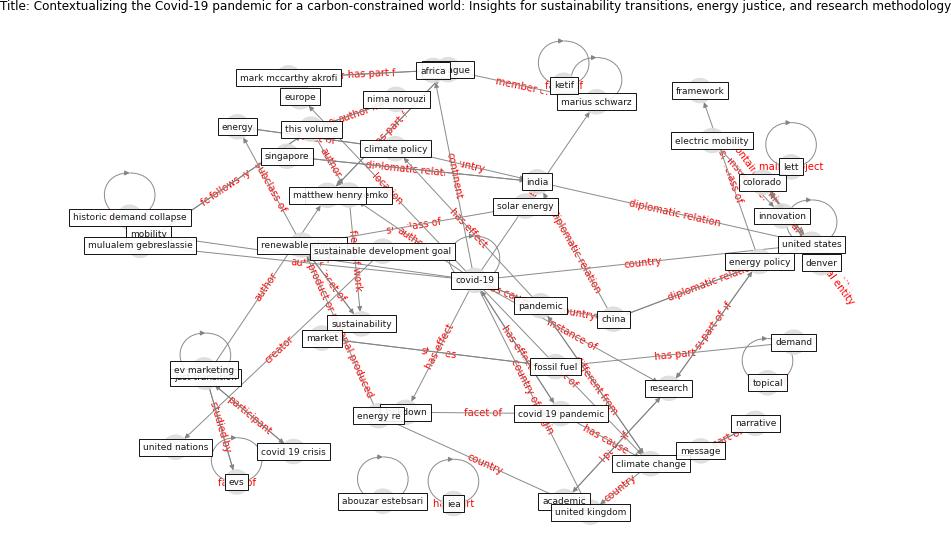

# Article: Contextualizing the Covid-19 pandemic for a carbon-constrained world: Insights for sustainability transitions, energy justice, and research methodology (sovacool_contextualizing_2020)

* Source: [10.1016/j.erss.2020.101701](https://doi.org/10.1016/j.erss.2020.101701)
* Year: 2020
* Cluster: [construction-resilience](cluster_5)

## Keywords

 * abouzar estebsari, abu dhabi, [academic](keyword_academic), [africa](keyword_africa), [air pollution](keyword_air_pollution), behavior, [canada](keyword_canada), caroline kuzemko, [china](keyword_china), class, [climate change](keyword_climate_change), climate policy, colleague, colorado, communication, conference, [covid 19 crisis](keyword_covid_19_crisis), [covid 19 pandemic](keyword_covid_19_pandemic), covid 19 virus, [covid-19](keyword_covid-19), d c, daily routine, demand, denver, dincer, economic incentive, electric mobility, [energy](keyword_energy), energy bill reduction or cancellation, energy demand, energy injustice, energy policy, energy poverty, energy re, energy vulnerability, [europe](keyword_europe), ev, ev marketing, evs, falmer, [fossil fuel](keyword_fossil_fuel), framework, g dubois, [health care](keyword_health_care), high education, historic demand collapse, hygiene, [iea](keyword_iea), [india](keyword_india), [industry](keyword_industry), [innovation](keyword_innovation), institution, ipcc, [italy](keyword_italy), jefferson, just transition, ketif, lett, [lockdown](keyword_lockdown), marius schwarz, mark mccarthy akrofi, market, [mask](keyword_mask), matthew henry, message, mexico, michael fall, [mobility](keyword_mobility), mulualem gebreslassie, narrative, neurophenomenal, nima norouzi, [pandemic](keyword_pandemic), [population](keyword_population), practice, price, [public transport](keyword_public_transport), renewable energy, [research](keyword_research), research methodology, retrain, [risk](keyword_risk), sadiq khan, [sar cov 2](keyword_sar_cov_2), [saudi arabia](keyword_saudi_arabia), singapore, solar energy, sovacool, [spain](keyword_spain), [stress](keyword_stress), survey, [sustainability](keyword_sustainability), [sustainable development goal](keyword_sustainable_development_goal), the pandemic, [this volume](keyword_this_volume), topical, [united kingdom](keyword_united_kingdom), [united nations](keyword_united_nations), [united states](keyword_united_states), [usa](keyword_usa)

## Concepts

 

## Neighbours

### Closest articles

* Covid-19 and the politics of sustainable energy transitions - [LINK](article_kuzemko_covid-19_2020)
* Validity of energy social research during and after COVID-19: challenges, considerations, and responses - [LINK](article_fell_validity_2020)
* The role of green roofs in post COVID-19 confinement: An analysis of willingness to pay - [LINK](article_manso_role_2021)
* The impact of the COVID-19 pandemic on the importance of urban green spaces to the public - [LINK](article_noszczyk_impact_2022)
* Urban form: Realising the value of green space: a planners’ perspective on the COVID-19 pandemic - [LINK](article_ahmadpoor_urban_2021)
* Effects of the COVID-19 pandemic on the use and perceptions of urban green space: An international exploratory study - [LINK](article_ugolini_effects_2020)
* Urban Green Infrastructure and Green Open Spaces: An Issue of Social Fairness in Times of COVID-19 Crisis - [LINK](article_reinwald_urban_2021)
* Green in times of COVID-19: urban green space relevance during the COVID-19 pandemic in Buenos Aires City - [LINK](article_marconi_green_2022)
* Should I Stay or Should I Go? Tourists’ COVID-19 Risk Perception and Vacation Behavior Shift - [LINK](article_bratic_should_2021)
* Seeing the invisible hand: Underlying effects of COVID-19 on tourists’ behavioral patterns - [LINK](article_li_seeing_2020)

### Closest BPs

* Blueprint: Mental health – Act: Do something - [LINK](bp_18)
* Blueprint: Mental health – Commit: Do something meaningfull - [LINK](bp_20)
* Blueprint: Mental health – Belong: Do something with someone - [LINK](bp_19)
