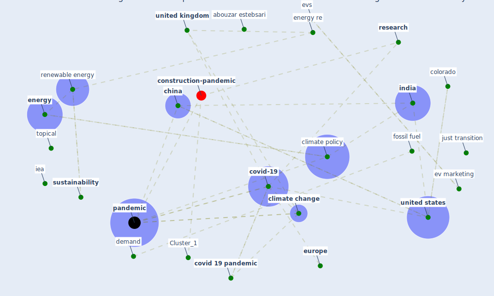

# Article: Contextualizing the Covid-19 pandemic for a carbon-constrained world: Insights for sustainability transitions, energy justice, and research methodology (sovacool_contextualizing_2020)

* Source: [10.1016/j.erss.2020.101701](https://doi.org/10.1016/j.erss.2020.101701)
* Year: 2020
* Cluster: [construction-pandemic](cluster_1)

## Keywords

 * abouzar estebsari, abu dhabi, academic, [africa](keyword_africa), [air pollution](keyword_air_pollution), behavior, [canada](keyword_canada), caroline kuzemko, [china](keyword_china), class, [climate change](keyword_climate_change), climate policy, colleague, colorado, communication, conference, [covid 19 crisis](keyword_covid_19_crisis), [covid 19 pandemic](keyword_covid_19_pandemic), covid 19 virus, [covid-19](keyword_covid-19), d c, daily routine, demand, denver, dincer, economic incentive, electric mobility, [energy](keyword_energy), energy bill reduction or cancellation, energy demand, energy injustice, energy policy, energy poverty, energy re, energy vulnerability, [europe](keyword_europe), ev, ev marketing, evs, falmer, [fossil fuel](keyword_fossil_fuel), framework, g dubois, [health care](keyword_health_care), high education, historic demand collapse, hygiene, [iea](keyword_iea), [india](keyword_india), [industry](keyword_industry), [innovation](keyword_innovation), institution, ipcc, [italy](keyword_italy), jefferson, just transition, ketif, lett, [lockdown](keyword_lockdown), marius schwarz, mark mccarthy akrofi, market, [mask](keyword_mask), matthew henry, message, mexico, michael fall, [mobility](keyword_mobility), mulualem gebreslassie, narrative, neurophenomenal, nima norouzi, [pandemic](keyword_pandemic), [population](keyword_population), practice, price, [public transport](keyword_public_transport), renewable energy, [research](keyword_research), research methodology, retrain, [risk](keyword_risk), sadiq khan, [sar cov 2](keyword_sar_cov_2), [saudi arabia](keyword_saudi_arabia), singapore, solar energy, sovacool, [spain](keyword_spain), [stress](keyword_stress), [survey](keyword_survey), [sustainability](keyword_sustainability), [sustainable development goal](keyword_sustainable_development_goal), the pandemic, [this volume](keyword_this_volume), topical, [united kingdom](keyword_united_kingdom), [united nations](keyword_united_nations), [united states](keyword_united_states), [usa](keyword_usa)

## Concepts

 

## Neighbours

### Closest articles

* Covid-19 and the politics of sustainable energy transitions - [LINK](article_kuzemko_covid-19_2020)
* Validity of energy social research during and after COVID-19: challenges, considerations, and responses - [LINK](article_fell_validity_2020)
* Addressing the impact of COVID-19 lockdown on energy use in municipal buildings: A case study in Florianópolis, Brazil - [LINK](article_geraldi_addressing_2021)
* Impacts of COVID-19 on residential building energy use and performance - [LINK](article_kawka_impacts_2021)
* Occupants’ behavior and activity patterns influencing the energy consumption in the Kuwaiti residences - [LINK](article_al-mumin_occupants_2003)
* Reflecting on Impacts of COVID19 on Sustainable Buildings and Cities - [LINK](article_gonzalez_reflecting_2021)
* The effect of occupant distribution on energy consumption and COVID-19 infection in buildings: A case study of university building - [LINK](article_mokhtari_effect_2021)
* Assessment of Building Automation and Control Systems in Danish Healthcare Facilities in the COVID-19 Era - [LINK](article_pedersen_assessment_2022)
* Ten questions concerning occupant health in buildings during normal operations and extreme events including the COVID-19 pandemic - [LINK](article_awada_ten_2021)
* Occupant health in buildings: Impact of the COVID-19 pandemic on the opinions of building professionals and implications on research - [LINK](article_awada_occupant_2022)

### Closest BPs

* Blueprint: nan - [LINK](bp_34)
* Blueprint: Tender support at building stage - [LINK](bp_9)
* Blueprint: Building Adaptation during a pandemic - [LINK](bp_14)
