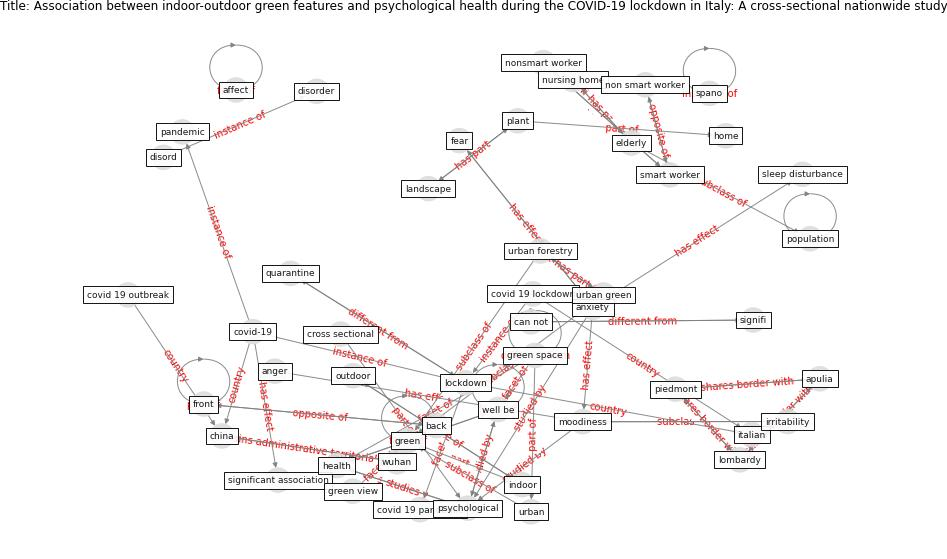

# Article: Association between indoor-outdoor green features and psychological health during the COVID-19 lockdown in Italy: A cross-sectional nationwide study (spano_association_2021)

* Source: [10.1016/j.ufug.2021.127156](https://doi.org/10.1016/j.ufug.2021.127156)
* Year: 2021
* Cluster: [building-space](cluster_9)

## Keywords

 * affect, anger, [anxiety](keyword_anxiety), apulia, back, boredom, bosco, can not, [china](keyword_china), confound variable, courtyard, covid 19 epidemic, covid 19 lockdown, covid 19 outbreak, [covid 19 pandemic](keyword_covid_19_pandemic), [covid-19](keyword_covid-19), cross sectional, descriptive statistic, disord, disorder, dream, elderly, emotion, [europe](keyword_europe), expo, [fear](keyword_fear), front, [garden](keyword_garden), giannico, [green](keyword_green), green feature, green space, green view, greenness, [health](keyword_health), [home](keyword_home), home confinement, home environment, horticultural, [indoor](keyword_indoor), indoor outdoor green feature, intervention, irritability, italian, [italy](keyword_italy), landscape, [lockdown](keyword_lockdown), lockdown period, lombardy, mario elia, [mental health](keyword_mental_health), [model](keyword_model), mood, moodiness, non smart worker, nonsmart worker, norway, nursing home, outdoor, [pandemic](keyword_pandemic), [perspective](keyword_perspective), pet, physical activity, piedmont, [plant](keyword_plant), [population](keyword_population), psychol, [psychological](keyword_psychological), [psychological health](keyword_psychological_health), psychological health outcome, psychological outcome, psychological state, psychology, [public](keyword_public), [quarantine](keyword_quarantine), [sar cov 2](keyword_sar_cov_2), sensitivity analysis, serotonin, signifi, significant association, single exposure regression, sleep disturbance, smart worker, smartphone, social isolation, spano, [state](keyword_state), [statistic](keyword_statistic), [study](keyword_study), suburb, test, think, [urban](keyword_urban), urban forestry, urban green, vincenzo giannico, [well be](keyword_well_be), [wellbee](keyword_wellbee), [wuhan](keyword_wuhan), zhu

## Concepts

 

## Neighbours

### Closest articles

* Green in times of COVID-19: urban green space relevance during the COVID-19 pandemic in Buenos Aires City - [LINK](article_marconi_green_2022)
* Urban Green Infrastructure and Green Open Spaces: An Issue of Social Fairness in Times of COVID-19 Crisis - [LINK](article_reinwald_urban_2021)
* The impact of the COVID-19 pandemic on the importance of urban green spaces to the public - [LINK](article_noszczyk_impact_2022)
* Effects of the COVID-19 pandemic on the use and perceptions of urban green space: An international exploratory study - [LINK](article_ugolini_effects_2020)
* The role of green roofs in post COVID-19 confinement: An analysis of willingness to pay - [LINK](article_manso_role_2021)
* The Impact of COVID-19 on Public Space: A Review of the Emerging Questions - [LINK](article_honey-roses_impact_2020)
* Impact of Covid-19 on the built environment - [LINK](article_mahima_impact_2022)
* Green spaces, especially forest, linked to lower SARS-CoV-2 infection rates: A one-year nationwide study - [LINK](article_jiang_green_2021)
* Learning from pandemics: Applying resilience thinking to identify priorities for planning urban settlements - [LINK](article_syal_learning_2021)
* Urban design attributes and resilience: COVID-19 evidence from New York City - [LINK](article_yang_urban_2021)

### Closest BPs

* Blueprint: Architecture design - [LINK](bp_2)
* Blueprint: Building Adaptation during a pandemic - [LINK](bp_14)
* Blueprint: Tender support at building stage - [LINK](bp_9)
